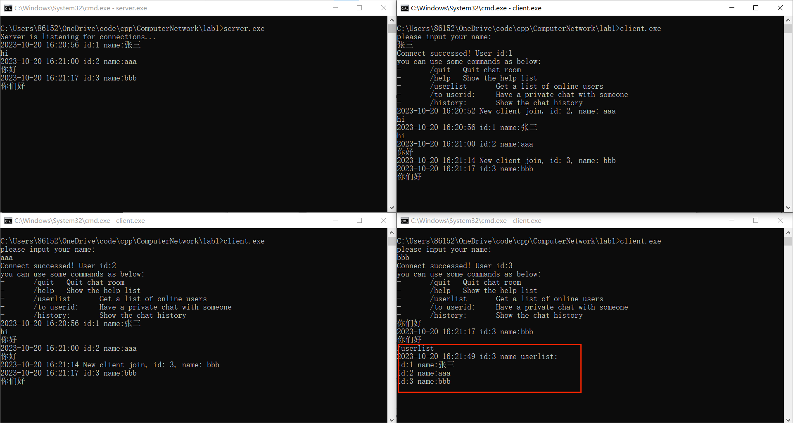

# lab1: 利用 Socket 编写一个聊天程序

> 姓名: 王茂增\
> 学号: 2113972\
> 代码: https://github.com/mzwangg/ComputerNetwork

## 实验要求

1. 给出你**聊天协议**的完整说明。

2. 利用 C 或 C++语言，使用**基本的**Socket 函数完成程序。不允许使用 CSocket 等封装后的类编写程序。

3. 使用**流式套接字、采用多线程（或多进程）**方式完成程序。

4. 程序应有**基本的对话界面**，但可以不是图形界面。程序应有正常的退出方式。

5. 完成的程序应能支持**多人聊天**，支持**英文和中文**聊天。

6. 编写的程序应该结构清晰，具有较好的可读性。

7. 在实验中观察是否有数据的丢失，提交**可执行文件、程序源码和实验报告**。。

**评分标准（总分 100 分）**：前期准备（10 分）、协议设计（15 分）、实验过程（35 分）、程序及规范性（20 分）、实验报告（20 分）。

## 实验原理

​ socket 编程的总体流程如下图所示。


### 服务器端：

1. **初始化 Socket**：服务器端初始化 Socket 以便与客户端通信。

2. **绑定（Bind）**：服务器将 Socket 绑定到一个特定的 IP 地址和端口号，以便监听来自客户端的连接请求。

3. **监听（Listen）**：服务器使用 listen()函数开始监听连接请求，等待客户端连接。

4. **接受连接（Accept）**：服务器使用 accept()函数阻塞等待来自客户端的连接请求。一旦有客户端连接请求到达，accept()函数返回一个新的套接字，用于与该客户端进行通信。

5. **接受请求**：服务端接收客户端的请求数据，进行处理。

6. **发送响应**：服务端处理完请求之后，将响应数据发送给客户端。

7. **关闭连接**：不断重复接受请求和发送响应过程，当交互结束后，关闭与客户端的连接，并释放资源。

### 客户端：

1. **初始化 Socket**：客户端初始化 Socket 以便连接到服务器。

2. **连接（Connect）**：客户端使用 connect()函数尝试连接到服务器的 IP 地址和端口。如果连接成功，客户端与服务器端建立了连接。

3. **发送请求**：客户端发送请求数据给服务器，等待服务器的响应。

4. **接收响应**：客户端接收服务器的响应数据，进行相应的处理。

5. **关闭连接**：不断重复发送请求与接受响应过程，当交互结束后，关闭与服务器的连接，并释放资源。

## 实验环境

在 windows10 下使用 g++编译得到可执行文件，编译命令如下：

```
g++ client.cpp -o client.exe -lws2_32
g++ server.cpp -o server.exe -lws2_32
```

## 协议设计

### 1.传输层协议

传输层协议使用 TCP 协议，地址为 IPV4 地址，数据报流式传输。

### 2.指令

1. **/quit:** 退出聊天室。
2. **/help:** 展示指令列表。
3. **/userlist:** 展示当前在线的所有用户。
4. **/to userid:** 与某个用户进行私聊。
5. **/history:** 查看历史聊天记录。

### 3.消息格式

将客户端和服务器端消息大小设计为 1024 字节，主要由 5 部分组成，消息类型，发送者 id，接受者 id, 消息时间，消息内容，其结构示意图如下所示：


1. ​ **消息类型:** 大小为 1 字节，代表发送消息的目的：
   - **type=0:** 聊天消息
   - **type=1:** 提交用户名和获得用户 id 消息
   - **type=2:** 退出消息
   - **type=3:** 用户列表消息
   - **type=4:** 私聊消息
   - **type=5:** 历史记录消息
2. ​ **发送者 id:** 大小为 1 字节，代表发送者的 id
3. ​ **接受者 id:** 大小为 1 字节，代表接受者的 id
4. ​ **消息时间:** 大小为 19 字节，代表发送消息时间，格式为：%Y-%m-%d %H:%M:%S
5. ​ **消息内容:** 包括'\0'字符在内，最大长度 1002 字节，代表发送的消息内容

### 4.客户端

客户端启动后，会向指定服务端发送建立套接字连接请求，建立后，用户会输入用户名并发给服务器，然后服务器返回该用户的 id。然后客户端建立监听线程，监听并处理来自服务器的信息。同时在主程序内不断等待用户的输入。

​ 当用户正常输入时，发送全体用户。当用户正确键入 '/' 开头的指令时，会执行相应的指令，否则则会报错。

### 5.服务端

服务端启动后，会在指定端口建立套接字并绑定，然后开始监听套接字，等待用户接入。用户接入时，服务端会为用户单独创建一个线程，并根据 type 属性执行对应的功能，当用户退出时，关闭线程。

## 代码编写

### 客户端代码编写

#### 参数及变量定义

代码首先定义了诸如名字和消息的最大大小，服务器 ip 地址、端口号等信息，然后定义了用户 id、套接字，消息缓冲区和时间、姓名字符串等全局变量，以方便后续代码的编写。

```cpp
// 定一些参数
const int NAME_SIZE = 64;
const int BUFF_SIZE = 1024;
const int SERVER_PORT = 5678;
const char *SERVER_IP = "127.0.0.1";

// 定义一些变量
uint8_t id;               // 用户id
SOCKET client_socket;     // 用户套接字
char recvBuff[BUFF_SIZE]; // 接受消息缓冲区
char sendBuff[BUFF_SIZE]; // 发送消息缓冲区
char tempBuff[BUFF_SIZE]; // 输出消息缓冲区
char name[NAME_SIZE];     // 用于缓存姓名
char time_str[20];        // 用于保存时间
```

#### 辅助函数

然后代码定义了一些辅助函数：

`get_time()`函数用于得到当前时间并将其格式化为字符串。首先通过`time()`获取当前时间，然后创建一个 tm 结构体`timeInfo`来存储时间信息，最后使用`strftime`将时间格式化为需要的格式。

`set_property()`函数用于设置消息的前面三个属性：`type`、`send_id`和`recv_id`。该函数首先将输入的整形数据转为`uint8_t`然后写入对应位置。

```cpp
// 获得当前时间，格式为 %Y-%m-%d %H:%M:%S
char *get_time()
{
    // 获取当前时间
    time_t currentTime = time(nullptr);
    // 创建一个tm结构体来存储时间信息
    tm timeInfo = *localtime(&currentTime);
    // 使用strftime将时间格式化为需要的格式
    strftime(time_str, sizeof(time_str), "%Y-%m-%d %H:%M:%S", &timeInfo);
    return time_str;
}

// 设置属性
void set_property(uint8_t type, uint8_t send_id, uint8_t recv_id)
{
    sendBuff[0] = (uint8_t)type;
    sendBuff[1] = (uint8_t)send_id;
    sendBuff[2] = (uint8_t)recv_id;
}
```

#### 主函数编写

代码首先依次执行初始化 winsock 库、创建套接字、设置服务器端口和地址、连接远程服务器等操作，由于较为简单，故不在实验报告中展示。

##### 设置姓名和获取 id

该部分首先要求用户输入姓名，然后将消息的请求头属性设置为 1、0、0，分别代表消息类型为设置姓名消息，发送者的 id 还未确定、接受者为服务器。然后在`sendBuff`中写入当前时间和输入的姓名，将消息发送给服务器，并接收服务器的响应，在响应中提取出`id`。最后输出一些提示信息。

```cpp
// 输入姓名
printf("please input your name:\n");
cin.getline(name, NAME_SIZE, '\n');

// 设置姓名与获取id
// type为1表示设置姓名，由于此时还没有id，用0表示id没确定
set_property(1, 0, 0);
sprintf(sendBuff + 3, "%.19s%s", get_time(), name);
send(client_socket, sendBuff, BUFF_SIZE, 0);
recv(client_socket, recvBuff, BUFF_SIZE, 0);
id = (uint8_t)recvBuff[2];//在响应中提取出id

// 输出提示信息
printf("Connect successed! User id:%u\n", id);
help_message(); // 输出指令列表
```

##### 接收消息线程

创建接收消息进程，该部分不断等待服务器的消息，并简单地将信息输出。

```cpp
// 创建线程，用于接受消息：
HANDLE recv_thread = CreateThread(NULL, 0, recvMessage, NULL, 0, 0);

// 客户端接受信息
// 该函数简单地输出服务器的响应即可
DWORD WINAPI recvMessage(LPVOID lpParam)
{
    while (true) {
        // 清空缓冲区
        memset(recvBuff, 0, BUFF_SIZE);
        recv(client_socket, recvBuff, BUFF_SIZE, 0);
        printf(recvBuff + 22);
    }
    return 0;
}
```

##### 主线程

主线程用于发送消息。其不断通过`cin.getline`等待用户的输入，然后对消息进行处理。

如果是普通消息，则将请求头属性设置为 0、id、0，表明消息类型为普通消息，发送者 id 为`id`，接收者为所有用户。然后在`sendBuff`中写入当前时间和用户输入的消息。

如果是指令消息：则根据不同指令类型进行不同处理：

1. **help 指令:** 直接调用`help_message()`，该函数由一些`cout`组成，输出每条指令的作用。
2. **quit 指令:** 设置请求头属性为 2、id、0，表明消息类型为退出消息，发送者 id 为`id`，接受者为服务器。然后只需在`sendBuff`中写入当前时间并发送，然后退出即可。
3. **userlist 指令:** 设置请求头属性为 3、id、0，表明消息类型为在线用户消息，发送者 id 为`id`，接受者为服务器。然后在`sendBuff`中写入当前时间和发送的消息。其中发送消息通过`strchr(tempBuff, ':') + 1`计算，即第一个":"后的字符串。然后将该信息发送给服务器。
4. **to userid 指令:** 设置请求头属性为 4、id、atoi(tempBuff + 4)，表明消息类型为私聊消息，发送者 id 为`id`，接受者 id 为用户输入 id。其中`atoi`函数用于将字符串转为整形。然后只需在`sendBuff`中写入当前时间并发送即可即可。
5. **history 指令:** 设置请求头属性为 5、id、0，表明消息类型为聊天记录消息，发送者 id 为`id`，接受者为服务器。然后只需在`sendBuff`中写入当前时间并发送，即可。
6. **其他指令:** 报错。

```cpp
// 主线程用于发送消息
while (true) {
    cin.getline(tempBuff, BUFF_SIZE, '\n');

    // 判断消息的类型，然后分别进行处理
    if (tempBuff[0] == '/') {//指令消息
        if (strcmp(tempBuff + 1, "help") == 0) {
            help_message();
        } else if (strcmp(tempBuff + 1, "quit") == 0) {
            set_property(2, id, 0);
            sprintf(sendBuff + 3, "%s", get_time());
            send(client_socket, sendBuff, BUFF_SIZE, 0);
            cout << "Quit successed!\n";
            break;
        } else if (strcmp(tempBuff + 1, "userlist") == 0) {
            set_property(3, id, 0);
            sprintf(sendBuff + 3, "%s", get_time());
            send(client_socket, sendBuff, BUFF_SIZE, 0);
        } else if (tempBuff[1] == 't' && tempBuff[2] == 'o') {
            set_property(4, id, atoi(tempBuff + 4));
            sprintf(sendBuff + 3, "%s%s", get_time(), strchr(tempBuff, ':') + 1);
            send(client_socket, sendBuff, BUFF_SIZE, 0);
        } else if (strcmp(tempBuff + 1, "history") == 0) {
            set_property(5, id, 0);
            sprintf(sendBuff + 3, "%s", get_time());
            send(client_socket, sendBuff, BUFF_SIZE, 0);
        } else {
            cout << "Wrong instruction!\n";
        }
    } else {//普通消息
        set_property(0, id, 0);
        sprintf(sendBuff + 3, "%.19s%s", get_time(), tempBuff);
        send(client_socket, sendBuff, BUFF_SIZE, 0);
    }
}
```

##### 退出程序

关闭套接字、清理 Winsock 库然后返回。

```cpp
closesocket(client_socket);
WSACleanup();
return 0;
```

### 服务器代码编写

在服务器代码中，定义的参数、变量、函数等很多与客户端代码一致，故下面仅介绍其独有的部分

#### 客户结构体数组

服务器部分定义了客户结构体并生成一个数组用于管理。包含客户端 id、是否有效、名称、客户端套接字、客户端地址等属性，并生成一个大小为 256 的数组，表明本程序最多支持 256 个客户端同时在线聊天。

```cpp
struct Client {
    int id;                  // 客户端id
    int flag = 0;            // 表明该用户端是否有效
    char name[NAME_SIZE];    // 名称
    SOCKET client_socket;    // 客户端套接字
    SOCKADDR_IN client_addr; // 客户端地址
} clients[CLIENT_SIZE];
```

#### 主线程

主线程用于处理用户的接入请求，该部分会首先通过循环找到一个空闲 id 分配给接入客户，然后等待客户端请求并接受，设置一些客户端属性，再接收客户端发送的设置名称消息，设置名称并返回消息。之后创建一个线程用于接收该客户的消息，并将该客户加入的消息发送给所有客户。

```cpp
    // 主线程用于处理用户的接入请求
    while (true) {
        for (int i = 0; i < CLIENT_SIZE; i++) {//选择一个空闲id分配给客户
            if (clients[i].flag == 0) {
                // 等待客户端请求并接受，设置一些客户端属性
                clients[i].client_socket = accept(server_socket, (SOCKADDR *)&clients[i].client_addr, &client_addr_len);
                clients[i].flag = 1;
                clients[i].id = i + 1;

                // 接收客户端发送的设置名称消息，设置名称并编写返回消息
                recv(clients[i].client_socket, recvBuff, BUFF_SIZE, 0);
                strcpy(clients[i].name, recvBuff + 22);
                set_property(1, 0, clients[i].id);
                sprintf(sendBuff + 3, "%.19s%.19s New client join, id: %d, name: %s\n", recvBuff + 3, recvBuff + 3, clients[i].id, clients[i].name);

                // 创建一个线程用于接收该客户的消息
                CloseHandle(Hthread[i]);
                Hthread[i] = CreateThread(NULL, 0, (LPTHREAD_START_ROUTINE)client_thread, &clients[i], 0, 0);

                // 将该客户加入的消息发送给所有客户
                for (int i = 0; i < CLIENT_SIZE; i++) {
                    if (clients[i].flag == 1) {
                        send(clients[i].client_socket, sendBuff, BUFF_SIZE, 0);
                    }
                }
            }
        }
    }
```

#### 客户线程

对于客户线程，我们建立了一个用于接收客户消息的线程数组，该数组的大小为 256，表明本程序最多支持 256 个客户同时聊天。

在线程函数中，为了防止多用户时冲突，故新申请局部变量。然后通过一个`while`循环不断等待该客户的请求，并根据消息类型分别进行处理。

处理部分主要通过`sprintf`函数对`local_sendBuff`进行处理。对于对话消息、退出消息，我们只需要简单设置一下格式即可。对于在线用户消息(`/userlist`)，我们需要遍历找到所有在线用户，然后将他们的`id`和`name`添加到`local_sendBuff`后面；对于私聊消息(`/to userid:`)，我们需要将消息单独发送给私聊用户；对于历史记录消息(`/history`)，我们需要通过`ifstream`读取`history.txt`文件并加入到消息中。

然后，如果消息类型小于 3，即普通消息或退出消息，需要广播到所有用户的消息，通过循环找到所有在线用户并发送消息实现。

最后在服务器中输出消息并将消息保存到`history.txt`，以便历史记录消息能成功实现。

```cpp
HANDLE Hthread[CLIENT_SIZE]; // 用于接收客户消息的线程数组

DWORD WINAPI client_thread(Client *now_client)
{
    // 为了防止多用户时冲突，故新申请局部变量
    char local_recvBuff[BUFF_SIZE]; // 接受消息缓冲区
    char local_sendBuff[BUFF_SIZE]; // 发送消息缓冲区
    int receive_len;

    while (true) {
        // 等待并接受用户请求
        memset(local_recvBuff, 0, BUFF_SIZE); // 清空local_recvBuff
        receive_len = recv(now_client->client_socket, local_recvBuff, BUFF_SIZE, 0);
        if (receive_len == 0 || receive_len == -1) {
            // 此时说明该用户已经退出，可结束循环
            now_client->flag = 0;
            break;
        }
        memcpy(local_sendBuff, local_recvBuff, BUFF_SIZE);

        // 根据消息类型分别进行处理
        if (local_recvBuff[0] == (uint8_t)0) {
            // 设置消息格式
            sprintf(local_sendBuff + 22, "%.19s id:%u name:%s\n%s\n", local_recvBuff + 3, now_client->id, now_client->name, local_recvBuff + 22);
        } else if (local_recvBuff[0] == (uint8_t)2) {
            // 设置消息格式
            sprintf(local_sendBuff + 22, "%.19s id:%u name:%s quit\n", local_recvBuff + 3, now_client->id, now_client->name);
        } else if (local_recvBuff[0] == (uint8_t)3) {
            // 设置消息格式
            sprintf(local_sendBuff + 22, "%.19s id:%u name userlist:\n", local_recvBuff + 3, now_client->id, now_client->name);
            for (int i = 0; i < CLIENT_SIZE; i++) { // 不断循环找到所有在线用户
                if (clients[i].flag == 1) {
                    sprintf(local_recvBuff + 22, "id:%u name:%s\n", clients[i].id, clients[i].name);
                    strcat(local_sendBuff + 22, local_recvBuff + 22); // 将在线用户信息拼接到local_sendBuff
                }
            }
            // 单独发送到请求客户
            send(now_client->client_socket, local_sendBuff, BUFF_SIZE, 0);
        } else if (local_recvBuff[0] == (uint8_t)4) {
            // 计算要发送的id
            int send_id = local_sendBuff[2] - 1;
            // 设置消息格式
            sprintf(local_sendBuff + 22, "%.19s id:%u name:%s to id:%u name:%s\n%s\n", local_recvBuff + 3, now_client->id, now_client->name, clients[send_id].id, clients[send_id].name, local_recvBuff + 22);
            // 将信息发给对方、自己
            send(clients[send_id].client_socket, local_sendBuff, BUFF_SIZE, 0);
            send(now_client->client_socket, local_sendBuff, BUFF_SIZE, 0);
            // 在服务器中记录
            printf("%s", local_sendBuff + 22);
        } else if (local_recvBuff[0] == (uint8_t)5) {
            // 通过ifstream读取history.txt
            ifstream ifs("history.txt");
            ifs.read(local_sendBuff + 22, BUFF_SIZE - 22);
            // 将消息发送给请求客户
            send(now_client->client_socket, local_sendBuff, BUFF_SIZE, 0);
        }

        // 如果消息类型小于3，说明是需要广播到所有用户的消息
        if (local_sendBuff[0] < (uint8_t)3) {
            for (int i = 0; i < CLIENT_SIZE; i++) {
                if (clients[i].flag == 1) {
                    send(clients[i].client_socket, local_sendBuff, BUFF_SIZE, 0);
                }
            }

            // 在服务器中输出并保存到history.txt
            printf("%s", local_sendBuff + 22); // 在服务器中记录
            ofstream ofs("history.txt", ios::app | ios::out);
            ofs << local_sendBuff + 22; // 在history.txt中记录
            ofs.close();
        }
    }

    // 关闭套接字
    closesocket(now_client->client_socket);
    return 0;
}
```

## 结果验证

下面我将分别验证基本的多人中英文聊天功能以及实现的各种指令，验证的结果在图中用**红框标出**。

### 多人中英文聊天验证


在实验中首先运行 server.exe，然后运行两个 client.exe。可以在图中他们的用户名分别为中文和英文，同时他们的 id 分别为 1 和 2。然后两人发送了"hi"和"你好"，**表明程序能正确进行中英文交流**。

之后运行第三个 client.exe，将其名字设为"bbb"，其 id 被分配为 3。然后他发送了"你们好"，其他两人即服务器均收到了该条消息，**表明程序能正确进行多人聊天**。

### /userlist 验证



在图中可以看出，client3 输入了"/userlist"，然后成功返回了当前在线的三人的 id 和姓名，且其他人和服务器均没有消息，因为该指令不需要广播。上述实验**表明程序能正确执行/userlist**。

### /quit 验证


在图中可以看出，client3 输入了"/quit"，然后成功退出了程序，且其他人和服务器均受到 client3 已经退出的消息。上述实验**表明程序能正确执行/quit**。

### /history 验证


在图中可以看出，有一个新用户登入并将其姓名设为李四，被分配到的 id 为 4。client4 输入了"/history"，成功得到了刚才其他几人的聊天记录。上述实验**表明程序能正确执行/history**。

### /to userid 验证


在图中可以看出，client4 输入了"/to 1:"，对 1 号用户进行了私聊。然后 1 号用户和服务器成功接收到了该消息，而 2 号用户并没有接收到。上述实验**表明程序能正确执行/to userid**。

### /help 验证


在图中可以看出，client1 输入了"/help"，并成功获得了指令列表。上述实验**表明程序能正确执行/help**。

### 实验结果

可以看到在实验中没有任何数据丢失，可支持中文和英文，客户端服务器端各个功能运行良好。
