# 实验2：配置Wb服务器，编写简单页面，分析交互过程

> 姓名: 王茂增\
> 学号: 2113972\
> 代码: https://github.com/mzwangg/ComputerNetwork

## 实验说明

**实验要求：**
1. 搭往Web服务器（自由选择系统），并制作简单的Wb页面，包含简单文本信息（至少包含专业、学号、姓名）、自己的LOG0、自我介绍的音频信息，页面不要太复杂，包含要求的基本信息即可。
2. 通过浏览器获取自己编写的Web页面，使用**Wireshark**捕获浏览器与Web服务器的交互过程，并进行简单的分析说明
3. 使用**HTTP**,不要使用HTTPS。
4. 提交实验报告，

**评分标准（总分100分）：**
1. 功能实现：
    - Web服务器搭建、编写Web页面（提交HTML文档）(30分)
    - Wiresharki铺获交互过程，使用Wiresharki过滤器使其仅显示HTTP协议，提交铺获文件(2O分)
2. 演示并讲解(30分)
3. 实验报告(20分)

## Web服务器搭建

### CSS文件

- `*` 部分：这是通用样式设置，它对所有元素应用了以下规则：
  - 去除内边距和外边距，确保元素在不同浏览器中具有一致的外观。
  - 设置框模型为 `border-box`，以确保元素的宽度和高度包括内边距和边框。

- `body` 部分：对整个页面的样式进行设置，包括：
  - 去除 `body` 元素的外边距。
  - 指定页面的字体为 Arial 或 sans-serif 字体。
  - 设置背景图片，充满整个页面，不重复，固定不滚动。
  - 使用 Flex 布局，使页面内容垂直居中对齐。
  - 设置页面的高度为视口高度的 100%。

- `.logo` 部分：这是用于 `.logo` 类的样式设置，包括：
  - 设置 `.logo` 类的高度为 60 像素，以控制图片的大小。
  - 在顶部添加了 10 像素的外边距，增加了与上方内容的间距。

- `.name` 部分：这是用于 `.name` 类的样式设置，包括：
  - 设置 `.name` 类的背景颜色为 RGB(28, 118, 201)。
  - 添加了 20 像素的边框圆角，使容器具有圆角外观。
  - 增加了 20 像素的内边距，以在容器内部创建空间。
  - 文本居中对齐。

- `.text` 部分：这是用于 `.text` 类的样式设置，包括：
  - 设置 `.text` 类的文本颜色为 aliceblue。
  - 通过设置外边距，增加了文本之间的间距。
  - 设置字体大小为 18 像素。

总的来说，这段CSS代码用于布局和样式化一个页面，包括背景、文本、图像等元素的外观和排列方式，以实现一致的页面设计。

```css
/* 通用样式设置，适用于所有元素 */
* {
    padding: 0;          /* 去除内边距 */
    margin: 0;           /* 去除外边距 */
    box-sizing: border-box; /* 设置框模型为border-box，以确保元素宽度和高度包括内边距和边框 */
}

/* 对整个页面的样式设置 */
body {
    margin: 0;           /* 去除body元素的外边距 */
    font-family: Arial, sans-serif; /* 设置文本字体为Arial或sans-serif字体 */
    background-image: url("src/bg.jpg"); /* 设置背景图片 */
    background-size: cover; /* 背景图片填充整个容器 */
    background-repeat: no-repeat; /* 背景图片不重复 */
    background-attachment: fixed; /* 背景图片固定不滚动 */
    display: flex; /* 使用Flex布局 */
    flex-direction: column; /* 子元素在垂直方向排列 */
    align-items: center; /* 沿水平方向居中对齐 */
    justify-content: center; /* 沿垂直方向居中对齐 */
    height: 100vh; /* 设置高度为视口的高度，以充满整个屏幕 */
}

/* .logo 类的样式设置 */
.logo {
    height: 60px; /* 设置高度为60像素 */
    margin-top: 10px; /* 在顶部添加10像素的外边距 */
}

/* .name 类的样式设置 */
.name {
    background-color: rgb(28, 118, 201); /* 设置背景颜色为RGB(28, 118, 201) */
    border-radius: 20px; /* 设置边框圆角半径为20像素 */
    padding: 20px; /* 设置内边距为20像素，以增加内容与边框之间的间距 */
    text-align: center; /* 文本居中对齐 */
}

/* .text 类的样式设置 */
.text {
    color: aliceblue; /* 设置文本颜色为aliceblue */
    margin: 10px 0; /* 设置上下外边距为10像素，左右外边距为0，以增加文本之间的间距 */
    font-size: 18px; /* 设置字体大小为18像素 */
}

```

### HTML文件

- `<meta>` 部分：设置文档的字符编码为UTF-8，以确保正确显示文本内容，同时设置视口属性，以适应不同设备的屏幕宽度。

- `<title>` 部分：设置页面标题，通常显示在浏览器标签页上。

- `<link>` 部分：引入外部的CSS样式表文件 `styles.css`，以样式化页面的外观和布局。

- `<body>` 部分：页面的主体内容，包括一个带有类名 "name" 的 `<div>` 元素，其中包含了以下元素：
  - `` 元素：用于显示图像，应用了名为 "logo" 的CSS类。
  - `<p>` 元素：包含个人信息文本，应用了名为 "text" 的CSS类。
  - `<audio>` 元素：插入音频文件，带有控件供用户播放和控制。

这段HTML代码构建了页面的结构和内容，并通过CSS样式表（`styles.css`）来定义外观和排版。

```html
<!DOCTYPE html>
<html lang="en">

<head>
    <meta charset="UTF-8"> <!-- 设置文档字符编码为UTF-8 -->
    <meta name="viewport" content="width=device-width, initial-scale=1.0"> <!-- 设置视口属性，适应不同设备的屏幕宽度 -->
    <title>Document</title> <!-- 设置页面标题 -->
    <link rel="stylesheet" type="text/css" href="styles.css"> <!-- 引入外部CSS样式表 -->
</head>

<body>
    <div class="name">
         <!-- 插入图像，并应用名为 "logo" 的CSS类 -->
        <p class="text">姓名：王茂增</p> <!-- 创建段落文本，应用名为 "text" 的CSS类 -->
        <p class="text">学号：2113972</p>
        <p class="text">专业：计算机科学与技术</p>
        <div>
            <audio src="src/introduce.mp3" controls></audio> <!-- 插入音频元素，带有控件供用户操作 -->
        </div>
    </div>
</body>

</html>
```

### 页面效果

使用`apache-tomcat-10.1.15`搭建本地服务器，将上述代码放在`/webapps/lab2`文件夹中。服务器的默认端口为`8080`，启动服务器并访问网址`http://localhost:8080/lab2/index.html`，效果如下：

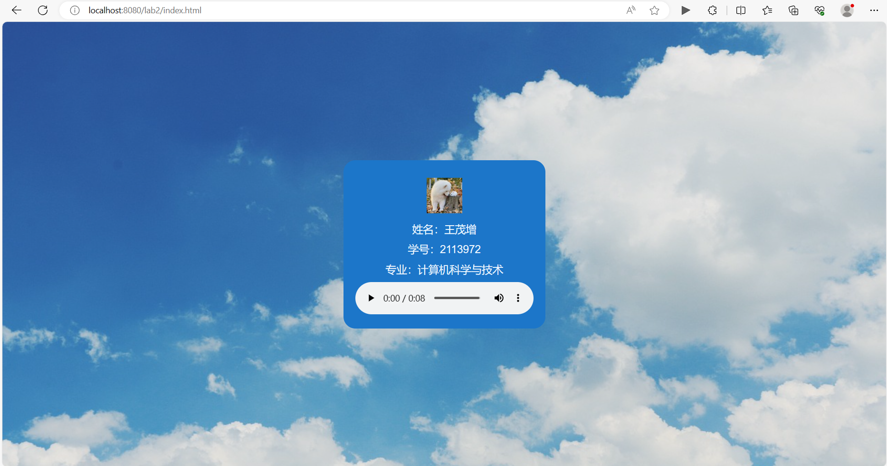

## 前置知识

### 使用工具

在本次实验中，我们使用 wireshark 作为抓包工具进行网页数据的抓包分析。首先，我们需
要选择想要进行监听的网络，由于服务器使用本地回环接口（loopback interface）进行本地通信，所以选择**Adapter for loopback traffic capture**。

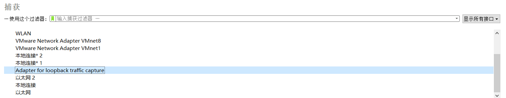

另外，在抓包之前，需要先**清除缓存的图形和文件**， 防止浏览器缓存图片和文件导致不再请求这些数据。

### HTTP/1.1 协议

HTTP/1.1（Hypertext Transfer Protocol 1.1）是一种用于在计算机之间传输超文本和其他资源的协议。它是互联网上最常用的HTTP协议版本之一，具有以下主要特点：

1. **持久连接**：HTTP/1.1引入了持久连接（Keep-Alive），允许在单个TCP连接上传输多个HTTP请求和响应，减少了连接建立和断开的开销，提高了性能。

2. **管线化**：HTTP/1.1支持管线化（Pipelining），允许客户端发送多个请求，而无需等待前一个响应。这提高了效率，减少了网络延迟。

3. **虚拟主机**：HTTP/1.1允许一个物理服务器托管多个虚拟主机，每个虚拟主机有自己的域名和配置。这使得多个网站可以共享同一个IP地址和端口。

4. **分块传输编码**：HTTP/1.1引入了分块传输编码，使服务器能够分块传输数据，而不需要等待整个响应生成。这对于动态生成的内容很有帮助。

5. **缓存控制**：HTTP/1.1引入了更强大的缓存控制机制，允许服务器和客户端更精确地控制响应的缓存行为。

6. **范围请求**：HTTP/1.1允许客户端请求资源的特定部分，而不是整个资源，这对于大型文件的分段下载非常有用。

7. **状态码**：HTTP/1.1定义了一系列状态码，用于表示请求的结果，如200表示成功，404表示未找到等。

8. **安全性**：HTTP/1.1引入了一些安全性特性，包括基本认证、摘要认证和SSL/TLS支持，以确保数据在传输过程中的安全性。

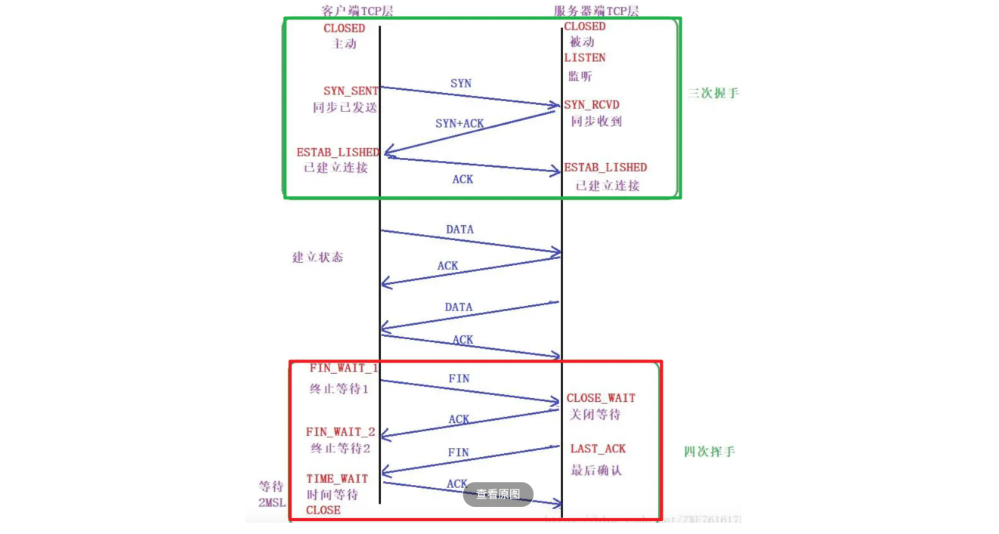

## Wireshark捕获交互过程

### 总体流程

1. 清除浏览器缓存的图形和文件
2. 打开wireshark并监听Adapter for loopback traffic capture接口
3. 打开Tomcat并访问网址http://localhost:8080/lab2/index.html
4. 关闭浏览器和Tomcat
5. 暂停wireshark，分析结果

wireshark部分结果如下：
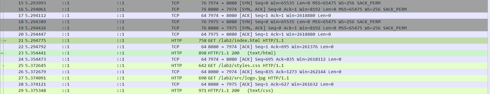

经分析可知，客户端共使用了11873和11874两个端口。其中，11874用于传输`<body>`中的`logo.jpg`和`introduce.mp3`文件，11873用于传输html文件、<head>中的styles.css、背景bk.jpg以及网站的标志图标favicon.jpg。

### 三次握手

由于两个端口的三次握手相似，现在仅分析11873端口的三次握手。使用过滤条件如下：

```cpp
tcp.port == 11873
```

得到三次握手如下所示：
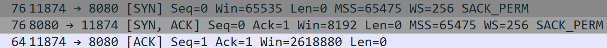

当进行TCP连接时，通常会遵循三次握手过程来确保双方能够正确建立连接。以下是每个握手步骤的详细分析：

**第一次握手（客户端向服务器发送SYN）**：

- 标志：SYN
  - 在第一次握手中，Client进入SYN_SENT状态，发送一个SYN帧来主动打开传输通道，表示客户端请求建立连接。这是一个初始连接请求。ACK标志通常未设置（值为0），因为还没有数据需要确认。

- 序号（Seq）：0
  - 这是客户端选择的初始序列号。它是一个随机数，用于唯一标识客户端发出的数据包。在这个阶段，客户端还没有发送任何数据，因此序列号为0。

- 确认号（Ack）：未设置
  - 在第一次握手中，Ack字段没有设置，因为还没有确认任何数据。

- 窗口大小（Win）：65535
  - 窗口大小表示客户端的接收窗口大小。它表示客户端能够接收的数据量。

- MSS（Maximum Segment Size）：65475
  - MSS表示TCP数据包的最大大小。在这里，客户端建议的MSS为65475字节。

- 窗口扩大因子（WS）：256
  - 窗口扩大因子是用来扩大窗口大小的值，以支持高带宽连接。这里设置为256，表示客户端愿意使用扩大的窗口。

- SACK（Selective Acknowledgment）允许位：SACK_PERM
  - 这表示客户端支持选择性确认，允许确认特定的数据段。

**第二次握手（服务器向客户端发送SYN和ACK）**：

- 标志：SYN，ACK
  - 在第二次握手中，Server端在收到SYN帧之后，会进入SYN_RCVD状态，同时返回SYN+ACK帧给Client，主要目的在于通知Client，Server端已经收到SYN消息，现在需要进行确认。

- 序号（Seq）：0
  - 服务器在第二次握手中选择了初始序列号，这个值通常与客户端的初始序列号有关，以确保双方能够正确同步。

- 确认号（Ack）：1
  - 这里服务器确认了客户端的初始序列号，它的值为客户端初始序列号加1，以表明服务器已经成功接收了客户端的请求。

- 窗口大小（Win）：8192
  - 服务器设置了窗口大小，表示服务器能够接收的数据量。在这里，窗口大小为8192字节。

- MSS（Maximum Segment Size）：65475
  - 服务器确认了客户端建议的MSS值，表示双方都愿意使用这个最大数据包大小。

- 窗口扩大因子（WS）：256
  - 服务器同样愿意使用窗口扩大因子，以支持高带宽连接。

- SACK（Selective Acknowledgment）允许位：SACK_PERM
  - 服务器也支持选择性确认。

**第三次握手（客户端向服务器发送ACK）**：

- 标志：ACK
  - Client在收到Server的第二次握手SYN+ACK确认帧之后，首先将自己的状态会从SYN_SENT变成ESTABLISHED，表示自己方向的连接通道已经建立成功。然后，Client发ACK帧给Server端，表示客户端确认了服务器的初始序列号。

- 序号（Seq）：1
  - 在第三次握手中，客户端选择了新的序列号，这个值通常与服务器的初始序列号有关，以确保双方能够正确同步。

- 确认号（Ack）：1
  - 客户端确认了服务器的初始序列号，它的值为服务器初始序列号加1，以表明客户端已经成功接收了服务器的响应。

- 窗口大小（Win）：2618880
  - 客户端设置了新的窗口大小，表示客户端能够接收的数据量。在这里，窗口大小为2618880字节。

这三次握手确保了双方都知道彼此的初始序列号、窗口大小以及其他参数，从而建立了可靠的TCP连接。每个字段的值是通过通信双方之间的协商和设置来确定的，以确保连接的正确性和可靠性。

### HTTP报文分析

使用如下过滤条件，得到结果：

```cpp
(tcp.port == 11873 || tcp.port == 11874) && http
```
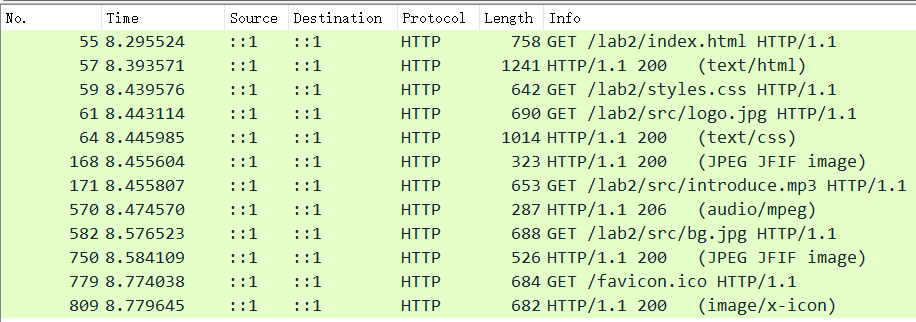

可以将其分为如下几步：

1. 11873端口首先通过GET请求`/lab2/index/html`文件，然后服务端返回了状态码`200`，表示请求成功。

2. 11873和11874端口分别请求了`/lab2/styles.css`和`/lab2/src/logo.jpg`文件，同样也获得了成功。

3. 11873和11874端口分别请求了`/lab2/src/introduce.mp3`和`/lab2/src/bg.jpg`文件，其中`/bg.png`文件获得了成功，而`introduce.mp3`返回的状态码为`206`，表示服务器已经成功处理了部分HTTP请求，通常用于范围请求,或分块传输中。

4. 11874端口请求了`/favicon.ico`文件，获得了成功。该文件常用于作为网站的标志图标。

下面我将分析几个主要文件的请求与响应。

#### styles.css

使用如下过滤条件，得到结果：

```cpp
tcp.port == 11873 || tcp.port == 11874
```

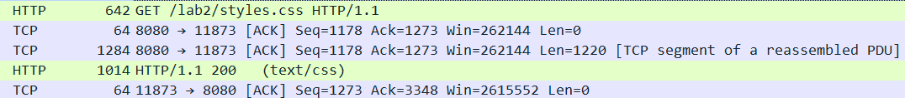

各步骤如下：

1. **GET /lab2/styles.css**

浏览器先是发起了一次HTTP的GET请求，向服务器请求/lab2/styles.css文件。此时对
于这条GET请求的报文进行分析：

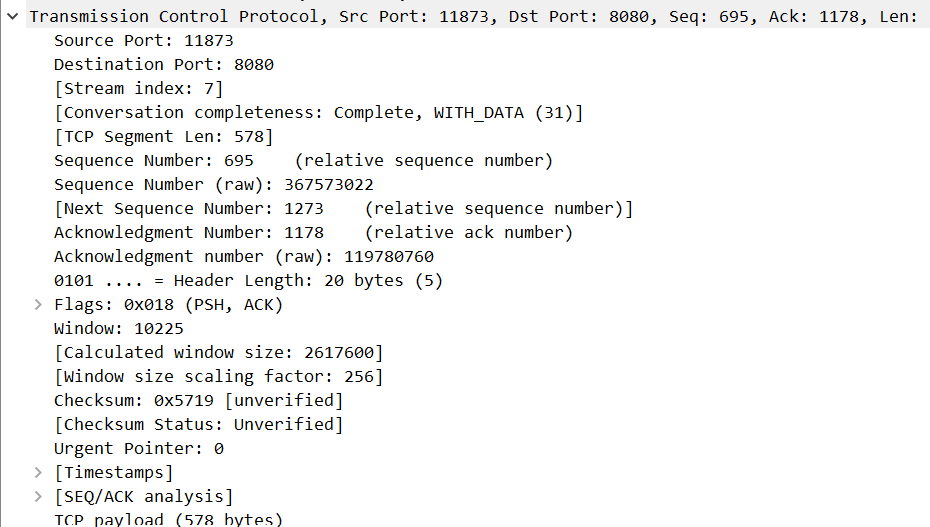

这个请求是客户端发给服务器的，FLAG 中 PSH 表示接收端应该尽快将这条报文交付给上
层应用。

由于在第三次握手时，消耗了一个序号，在之前获取index.html时，TCP报文的净荷字节数为694， 在之后的确认报文的净荷字节数为0，所以seq为1+694+0=695。而本报文的净荷字节数为578，下一个seq应该为1273。

而ack值为1178，这是由于服务器发送来的前一条报文HTTP/1.1 200的seq为1178，所以本次的ack为1178.

接下来分析一下 HTTP 报文。

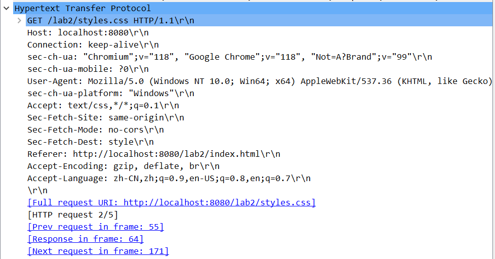

这段数据是一个HTTP请求的内容，它用于请求服务器获取特定资源，具体解释如下：

1. **Hypertext Transfer Protocol**: 这是HTTP协议的标识，指示这是一个HTTP请求。

2. **GET /lab2/styles.css HTTP/1.1**: 这是HTTP请求的第一行，它包含了请求方法（GET）、请求的资源路径（/lab2/styles.css），以及使用的HTTP协议版本（HTTP/1.1）。这表明客户端正在请求名为"styles.css"的资源。

3. **Host: localhost:8080**: 这是HTTP请求头部的一部分，它指示请求的目标主机和端口号。在这里，请求将被发送到本地主机（localhost）的8080端口。

4. **Connection: keep-alive**: 这是HTTP请求头部的一部分，表示客户端请求保持持久连接，以便在一定时间内可以继续使用同一连接来发送或接收其他请求和响应。

5. **sec-ch-ua: ...**: 这是一系列HTTP请求头部字段，通常用于传递关于用户代理（User-Agent）和浏览器的信息。

6. **Accept: text/css,*/*;q=0.1**: 这是HTTP请求头部的一部分，指示客户端接受响应的MIME类型。在这里，它表示客户端可以接受"text/css"类型的资源，或者任何其他类型，但优先级较低（q=0.1）。

7. **Sec-Fetch-Site, Sec-Fetch-Mode, Sec-Fetch-Dest**: 这些是HTTP请求头部字段，通常与浏览器的安全性和隐私相关，以帮助服务器和浏览器做出更好的决策。

8. **Referer: http://localhost:8080/lab2/index.html**: 这个字段表示请求的来源，通常是前一个页面的URL。在这里，它指示请求是从"http://localhost:8080/lab2/index.html"页面发起的。

9. **Accept-Encoding: ...**: 这是HTTP请求头部的一部分，指示客户端支持的压缩算法，以便服务器可以选择适当的压缩方式来传输响应。

10. **Accept-Language: ...**: 这是HTTP请求头部的一部分，表示客户端的首选语言设置，以便服务器可以返回相应的语言版本。

最后，"[Full request URI: ...]"和其他方括号内的内容提供了一些关于请求的附加信息，如完整的请求URI、请求在帧内的位置等。

总的来说，这是一个HTTP GET请求，用于获取名为"styles.css"的资源，请求的目标是本地主机的8080端口，请求头部包含了一些浏览器和客户端的相关信息，以及请求接受的资源类型。

2. **服务端确认报文**

服务端发送一个仅含报文头的确认报文，表示接收到了客户端的GET请求。

3. **服务端发送styles.css文件**

服务端发送了一个长度为1284的报文，里面包含了css文件，[TCP segment of a reassembled PDU] 表示这个数据包包含了一个TCP数据段的一部分，可能是在接收端重新组装数据段的结果。重新组装是为了将多个小的数据段组合成完整的消息或数据流。

4. **服务端返回响应**

服务端返回状态码200，表示请求成功。

5. **客户端确认报文**

客户端发送一个仅含报文头的确认报文，表示接收到了服务端的响应。

#### favicon.ico

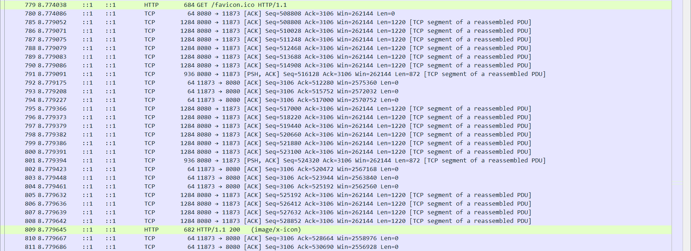

通过对报文的分析，可以推测，服务端是通过分别发送RGB三个通道的方式来传输图片的。又由于每一个通道中的数据量比较大，超过了 MSS ，所以一个完整的TCP报文被拆分成了多段分别进行传输。在客户端这边采用了延迟相响应的方式，接收到一个完整的TCP报文之后才会给服务端发送 ACK 确认报文。由于单独发送确认报文并不会消耗序号，因此可以看到在接收图像的过程中，客户端这边的Seq 值一直为670。

#### introduce.mp3

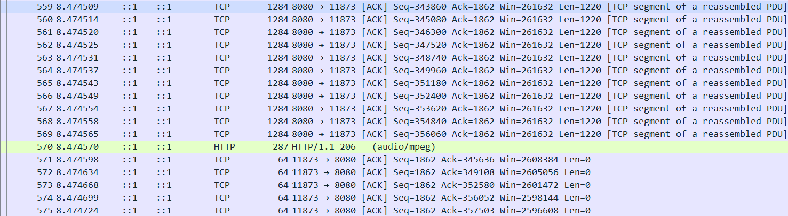

请求`introduce.mp3`与请求图片类似，也会分段进行传输。

HTTP状态码`206`表示"Partial Content"，这个状态码通常用于表示服务器已经成功处理了一个范围请求（Range Request）。在HTTP请求中，客户端可以通过Range请求部分资源，而不是完整的资源。这对于大型文件的断点续传或分段下载非常有用。具体含义是：服务器成功处理了客户端的部分请求，然后返回了请求范围内的数据，HTTP响应中会包含请求范围的实体内容。这通常用于支持流媒体、大型文件下载或多线程下载等场景。

### 四次挥手

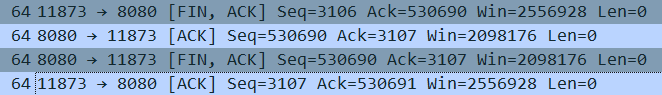

1. 第一个数据包 (No. 1213)：
   - 标志: [FIN, ACK]，表示这是一个带有FIN（Finish）和ACK（Acknowledgment）标志的数据包。表示客户端向服务端申请断开连接。
   - Seq=3106: 这是客户端发送的序列号，表示客户端发送的数据量。
   - Ack=530690: 这是客户端期望收到的下一个序列号，表示客户端已经收到了服务端的数据到530689，现在期望接收530690。

2. 第二个数据包 (No. 1214)：
   - 标志: [ACK]，表示这是一个确认标志。该ACK确认报文的含义是：“我同意你的连接断开请求”。之后，若服务端还要发送数据给对方，对方依然会接受。被动断开方的CLOSE-WAIT（关闭等待）还要持续一段时间，也就是整个CLOSE-WAIT状态持续的时间。
   - Seq=530690: 这是服务端发送的序列号，表示服务端发送的数据量。
   - Ack=3107: 这是服务端期望收到的下一个序列号，表示服务端已经收到了客户端的FIN标志，现在期望接收到客户端的下一个数据包。

3. 第三个数据包 (No. 1225)：
   - 标志: [FIN, ACK]，表示这是一个带有FIN和ACK标志的数据包，类似于第一个数据包，但这次是由服务端发送的，向客户端申请断开连接。
   - Seq=530690: 这是服务端发送的序列号，表示服务端发送的数据量。
   - Ack=3107: 这是服务端期望收到的下一个序列号，表示服务端已经收到了客户端的FIN和ACK标志，现在期望接收到客户端的下一个数据包。

4. 第四个数据包 (No. 1227)：
   - 标志: [ACK]，表示这是一个确认标志，类似于第二个数据包，表示同意断开连接。在等待完成2MSL的时间后，如果期间没有收到其他报文，则证明对方已正常关闭，主动断开方的连接最终关闭。
   - 数据: 这个数据包没有附带数据，Len=0。
   - Seq=3107: 这是客户端发送的序列号，表示客户端发送的数据量。
   - Ack=530691: 这是客户端期望收到的下一个序列号，表示客户端已经收到了服务端的FIN和ACK标志，现在期望接收到服务端的下一个数据包。

这四个数据包组成了TCP四次挥手过程，用于正常关闭一个TCP连接，确保双方都不再发送数据，而且双方都收到了对方的关闭请求和确认。

### 重点难点

1. **为什么连接建立的时候是三次握手，可以改成两次握手吗？**
三次握手完成两个重要的功能：一是双方都做好发送数据的准备工作，而且双方都知道对方已准备好；二是双方完成初始SN序列号的协商，双方的SN序列号在握手过程中被发送和确认。
如果将三次握手改成两次握手，可能导致问题。如果ACK确认SYN+ACK帧在传输中丢失，Client没有收到，Client将无法知道Server是否已准备好，也不知道Server的SN序列号。Client将继续等待ACK确认，这可能导致死锁。如果Server在没有收到ACK确认的情况下超时并重发数据帧，而Client没有收到重发的数据帧，连接就会被阻塞。

2. **如果已经建立了连接，但是Client端突然出现故障了怎么办？**
Server端设有保活计时器，每当它收到Client端的数据帧时，计时器会被复位。通常保活计时器的超时时间设置为2小时。如果Server端在2小时内没有收到Client端的任何数据帧，它会发送探测报文段，以后每隔75秒发送一次。如果连续发送10个探测报文都没有响应，Server端就认为Client端发生故障，然后关闭连接。这样可以及时处理Client端故障情况

3. **为什么主动断开方在TIME-WAIT状态必须等待2MSL的时间？**
TIME-WAIT状态的等待时间是为了确保两端都能安全地关闭连接。在不可靠的网络环境中，被动断开方发送的FIN+ACK可能会丢失，导致被动方无法正常进入CLOSED状态。如果经过一个MSL的时间，还没收到ACK，则被动断开方会再次发送一个FIN+ACK，所以主动方在TIME-WAIT状态等待2MSL的时间，以确保收到了被动方重传的FIN+ACK报文。这样，双方都能顺利关闭连接。
此外，TIME-WAIT状态还有一个作用，防止“旧连接的已失效的数据报文”出现在新连接中。等待2MSL时间内，网络中的旧连接数据报文都会被丢弃，确保新的连接不会受到干扰。

2. **为什么关闭连接的需要四次挥手，而建立连接却只要三次握手呢？**
关闭连接时，被动断开方在收到对方的FIN结束请求报文时，很可能业务数据没有发送完成，并不能立即关闭连接，被动方只能先回复一个ACK响应报文。所以，被动断开方的确认报文需要分成两步，这导致需要四次挥手。
而在建立连接时，Server端的应答相对简单。当Server端收到Client端的SYN连接请求报文后，其中的ACK报文表示对请求报文的应答，SYN报文表示服务端的连接也已经同步开启了。在建立连接时，双方没有业务数据需要交换，所以可以将SYN和ACK合并成一个SYN+ACK报文，从而只需要三次握手即可。


