# lab3-2：基于 UDP 服务设计可靠传输协议并编程实现

> 姓名: 王茂增\
> 学号: 2113972\
> 代码: https://github.com/mzwangg/ComputerNetwork

## 实验要求

在实验 3-1 的基础上，将停等机制改成基于滑动窗口的流量控制机制，**接收窗口为 1，发送窗口大于 1**，支持**累积确认**，完成给定测试文件的传输。

1. 协议设计：**数据包格式，发送端和接收端交互**，详细完整

2. 流水线协议：**多个序列号**

3. 发送缓冲区、接收缓冲区

4. 累积确认：**Go Back N**

5. 日志输出：收到/发送数据包的**序号、ACK、校验和等**，发送端和接收端的
   窗口大小等情况，传输时间与吞吐率

6. 测试文件：必须使用助教发的测试文件（1.jpg、2.jpg、3.jpg、helloworld.txt）

**评分标准（总分 100 分）**：协议设计、功能实现（30 分）、演示并讲解（30 分）、程序及规范性（20 分）、实验报告（20 分）

## 实验环境

在 windows10 下使用 `g++` 编译得到可执行文件，编译命令如下：

```
g++ client.cpp -o client.exe -lws2_32
g++ server.cpp -o server.exe -lws2_32
```

## 程序简介

1. 使用**两次握手**和**两次挥手**进行连接建立和连接关闭。

2. 使用基于**滑动窗口**的流量控制机制并支持**累积确认**。

3. 使用**循环队列**作为发送缓冲区。

4. 使用**mutex**保护发送缓冲区，防止在多线程环境下出现错误。

5. 发送端共有 3 个线程，包括**消息接收线程**、**消息发送线程**和**超时重传线程**。

6. 接收端共有 2 个线程，包括**消息接收/发送线程**和**等待退出线程**。

## 协议设计及实现

### 1.数据包格式

对于数据包的设计，我使用了常见的 TCP 协议中的一些字段，例如源端口、目的端口、确认号、序列号等，并额外添加了一些自定义标志，如文件描述标志 `FHD`。这样的设计可以支持基本的连接建立、数据传输和连接关闭操作。消息设计如下：

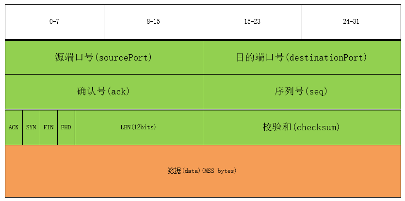

这是一个基于 UDP 协议的简化消息数据包设计，每个消息包含以下字段：

- `sourcePort`（源端口）：占用 16 位，表示消息的源端口号。

- `destinationPort`（目的端口）：占用 16 位，表示消息的目的端口号。

- `ack`（确认号）：占用 16 位，会在发送确认消息时使用。

- `seq`（序列号）：占用 16 位，会在发送数据消息时使用。

- `flagAndLength`（标志和长度）：占用 16 位，按位划分为 ACK(15)、SYN(14)、FIN(13)、FHD(12) 和 LEN(11-0)。

  - `ACK`（确认标志）：用于指示消息是否是确认消息。

  - `SYN`（同步标志）：用于建立连接的握手阶段。

  - `FIN`（结束标志）：用于连接的关闭阶段。

  - `FHD`（文件描述标志）：用于指示消息携带文件描述信息。

  - `LEN`（长度）：占用 12 位，表示消息数据段的长度。

- `checksum`（校验和）：占用 16 位，用于校验消息的完整性。

- `data`（数据段）：占用 MSS（最大报文段长度），用于存储消息的实际数据。

### 2.伪首部格式

对于伪首部，同样参考了 TCP 的伪首部设计，其中包含了源 IP 地址，目的 IP 地址，zero，协议号，以及数据报的长度。

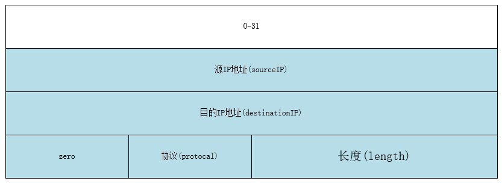

这是一个用于 TCP 协议校验和计算的伪首部结构体设计。伪首部是用于计算校验和的附加数据结构，它包含了 IP 层和 TCP 层报文头中的一些字段。

- `sourceIP`（源 IP 地址）：占用 32 位，表示消息的源 IP 地址。

- `destinationIP`（目的 IP 地址）：占用 32 位，表示消息的目的 IP 地址。

- `zero`：占用 8 位，用于填充字节，目前无特定功能。

- `protocol`（协议）：占用 8 位，表示上层协议的类型，这里使用 13，表示 UDP 协议。

- `length`（长度）：占用 16 位，表示报文的长度。

该伪首部的主要目的是在计算 TCP 报文校验和时，将 TCP 报文头和数据部分加入计算，以增加校验的准确性。这是因为校验和算法需要覆盖整个数据报文，包括 TCP 报文和 IP 报文头。

### 3.建立、断开链接

由于本实验仅需实现单向的通信，即发送端向接收端的发送，所以对 TCP 的三次握手和四次挥手进行了一定的简化，使用**两次握手**和**两次挥手**建立、断开链接。

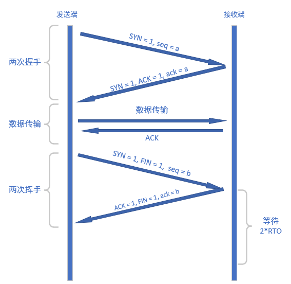

#### 两次握手:

1. **发送端发送连接请求（SYN）：**

   - 发送端向接收端发送一个带有 `SYN`（同步）标志的连接请求报文，并将报文的 `seq` 设为当前的 `nextSeqNum`(下一个序列号) 。

2. **接收端响应（ACK + SYN）：**

   - 接收端收到发送端的连接请求后，比较接收报文的 `seq` 与 自身的 `expectedSeq`(期望序列号)：若相同则向发送端发送确认（`ACK`）和同步（`SYN`）标志的报文，并将报文的 `ack` 设为接收报文的 `seq`；若不相同则重新发送上一个 ack。

#### 两次挥手:

1. **发送端发送连接终止请求（FIN + ACK）：**

   - 发送端完成数据传输后，向接收端发送一个带有 `FIN`（结束）和 `ACK`(确认) 标志的报文。发送端进入半关闭状态，在收到接收端的 `ACK | FIN` 后进入关闭状态。

2. **接收端响应（FIN + ACK）：**

   - 接收端收到发送端的连接终止请求后，发送带有 `FIN`（结束）和 `ACK`(确认) 的报文表示已收到发送端的 FIN， 并在等待两个 `RTO` 之后关闭。

### 4.校验和

对于检验和，我在`Message`类中实现了三个成员函数，下面分别进行介绍：

1. **`setChecksum(PseudoHeader* pseudoHeader)`：**

   - 该函数用于设置消息的校验和。

   - 首先，将消息的校验和 `checksum` 清零。

   - 然后，调用 `calChecksum` 函数计算校验和，并取其反码，将结果存储在 `checksum` 中。

   ```cpp
   // 设置校验和
   void setChecksum(PseudoHeader* pseudoHeader) {
       // 将checksum清零并计算校验和
       checksum = 0;
       checksum = ~calChecksum(pseudoHeader);
   }
   ```

2. **`bool checksumValid(PseudoHeader* pseudoHeader)`：**

   - 该函数用于判断消息的校验和是否有效。

   - 调用 `calChecksum` 函数计算校验和，如果等于 `0xFFFF`，则返回 `true` 表示校验和有效，否则返回 `false`。

   ```cpp
   // 判断校验和是否有效
   bool checksumValid(PseudoHeader* pseudoHeader) {
       // 判断校验和是否为0xFFFF
       return calChecksum(pseudoHeader) == 0xFFFF;
   }
   ```

3. **`uint16_t Message::calChecksum(PseudoHeader* pseudoHeader)`：**

   - 该函数用于计算消息的校验和。
   - 使用累加和算法计算伪首部和消息数据的校验和。
   - 累加和算法遍历伪首部和消息数据的每个 16 位块，将它们相加，并将进位加到后面。
   - 返回计算得到的 16 位校验和。

   ```cpp
   // 计算校验和的函数，传入伪首部指针作为参数
   uint16_t Message::calChecksum(PseudoHeader* pseudoHeader) {
       uint32_t sum = 0;
       // 计算伪首部的校验和
       for (int i = 0; i < sizeof(PseudoHeader) / 2; i++) {
           sum += ((uint16_t*)pseudoHeader)[i];
           sum = (sum & 0xffff) + (sum >> 16);
       }
       // 计算数据的校验和
       for (int i = 0; i < sizeof(Message) / 2; i++) {
           sum += ((uint16_t*)this)[i];
           sum = (sum & 0xffff) + (sum >> 16);
       }
       return (uint16_t)sum;
   }
   ```

### 5.Go-Back-N

#### 发送端

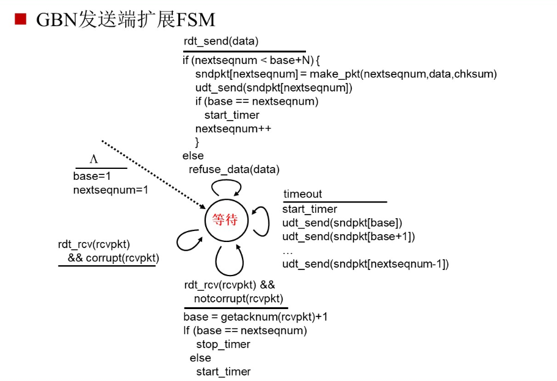

##### 发送缓冲区

由于发送缓冲区最大大小为`WIN_SIZE`，删除时只会删除最前方的数据包，插入时只会在最后方插入，可以使用**循环队列**实现，能最大限度的减少对空间的浪费，并实现 `O(1)`的插入与删除。

下列代码定义了`SendBuffer`类，其中包含了起始位置的索引 begin、结束位置的索引 end 以及一个固定大小的 buffer 数组用于存储数据包。主要实现了以下几个功能：

- **isEmpty()**: 判断发送缓冲区是否为空。
- **isFull()**: 判断发送缓冲区是否已满。
- **nextIndex(int index)**: 获取下一个索引位置，实现了循环队列的索引更新。
- **nextEmpty()**: 获取下一个空位置的数据包指针，如果缓冲区已满则返回 nullptr。
- **pop():** 弹出一个数据包指针，如果缓冲区为空则返回 nullptr。

这个类的设计主要用于管理发送端的数据包缓冲区，通过这些函数可以方便地判断缓冲区状态、获取下一个插入位置、以及弹出已经发送的数据包。

```cpp
class SendBuffer {
public:
    int begin;               // 起始位置的索引
    int end;                 // 结束位置的索引
    Message buffer[MAX_SIZE];// 存储数据包的缓冲区

    // 判断发送缓冲区是否为空
    bool isEmpty() { return begin == end; }
    // 判断发送缓冲区是否已满
    bool isFull() { return nextIndex(end) == begin; }
    // 获取下一个索引位置
    int nextIndex(int index) { return (index + 1) % MAX_SIZE; }
    // 获取下一个空位置的数据包指针，如果缓冲区已满则返回 nullptr
    Message* nextEmpty() {
        if (isFull())
            return nullptr;
        Message* retPtr = buffer + end;
        end = nextIndex(end);
        return retPtr;
    }
    // 弹出一个数据包指针，如果缓冲区为空则返回 nullptr
    Message* pop() {
        if (isEmpty())
            return nullptr;
        Message* retPtr = buffer + begin;
        begin = nextIndex(begin);
        return retPtr;
    }
};
```

##### 超时重传线程

发送端会建立一个`resendThread`线程，根据重传超时时间定时执行数据包的重新发送，通过互斥锁保护共享资源，同时通过随机数模拟了一定的丢包情况。

- **函数逻辑解析：**：

1. **计时器**。每次循环休眠 1 毫秒。并检查定时器是否有效，若无效则继续循环，否则增加等待时间，并检查等待时间是否小于重传超时（RTO），若是则继续循环，等待下一个时刻。

2. **更新变量**。重置等待时间，并增加发送包数量计数和丢失包数量计数。

3. **消息重传**。使用互斥锁保护发送缓冲区，防止多线程冲突。遍历发送缓冲区（sendBuffer），重新发送其中的所有数据包。在遍历的过程中，通过随机数模拟丢包情况，一定概率下不发送数据包。

```cpp
// 线程函数，用于重新发送超时的数据包
DWORD WINAPI resendThread() {
    while (true) {
        Sleep(1);//休眠1毫秒
        if (!timerValid)//当定时器无效时，继续循环
            continue;
        waitTime++;//增加等待时间
        if (waitTime < RTO)//当等待时间小于重传超时时，继续循环
            continue;

        waitTime = 0;     // 重置等待时间
        sendNum += 1;     // 增加发送包数量计数
        lossNum += 1;     // 增加丢失包数量计数

        // 使用互斥锁保护发送缓冲区，重新发送sendBuffer的所有报文
        std::lock_guard<std::mutex> lockGuard(bufferMutex);
        for (int i = sendBuffer.begin; i != sendBuffer.end;
             i = sendBuffer.nextIndex(i)) {
            if (rand() % 100 < LOSS_RATE)// 模拟丢包情况
                continue;
            sendto(serverSocket, (char*)(sendBuffer.buffer + i),
                   sizeof(Message), 0, (sockaddr*)&clientAddr,
                   sizeof(SOCKADDR_IN));// 发送数据包
        }
    }
    return 0;
}
```

##### 接收消息线程

发送端会在最开始建立一个`recvThread`线程，用于接收、检验和处理消息。其实现逻辑如下：

1. **接收消息**：使用 `recvfrom` 函数等待接收消息，将接收到的数据包存储在 `recvBuffer` 中。

2. **检验消息**：检测是否成功接收数据包，若失败则输出错误信息并退出程序;检查消息的校验和是否有效，若校验和无效则不做任何处理，等待超时重传。

3. **处理消息**：使用互斥锁保护发送缓冲区，使用循环弹出发送缓冲区中`recvBuffer.ack`之前的所有数据包，表明这些数据包已确认收到，实现**累积确认**，并更新 `base` 和定时器状态。(如果是已经确认的数据包，则什么也不做)。如果接收到握手成功的消息，输出握手成功的日志。如果接收到挥手成功的消息，输出挥手成功的日志，然后**结束线程**。

总体来说，该线程负责处理接收端的数据包，验证校验和，更新计时器状态，并在接收到 `FIN|ACK` 时退出线程。

```cpp
// 线程函数，用于接收数据包
DWORD WINAPI recvThread() {
    // 等待接收消息
    Message recvBuffer;
    while (true) {
        int clientAddressLength = sizeof(SOCKADDR);
        int recvLength = recvfrom(serverSocket, (char*)&recvBuffer, sizeof(Message), 0, (sockaddr*)&clientAddr, &clientAddressLength);

        // 检测是否接收成功
        if (recvLength == -1)
            exit(0);

        // 检查校验和
        if (recvBuffer.checksumValid(&recvPseudoHeader)) {
            std::lock_guard<std::mutex> lockGuard(bufferMutex);
            // 弹出已确认的数据包，更新 base
            for (int i = prevSeq(base); i != recvBuffer.ack; i = nextSeq(i)) {
                sendBuffer.pop();
                base = nextSeq(base);

                // 更新定时器状态
                waitTime = 0;
                timerValid = (base != nextSeqNum);
            }

            // 挥手成功时退出
            if ((recvBuffer.getFlag(FIN | ACK)) == (FIN | ACK))
                return 0;
        }
    }
}
```

##### 发送消息线程(主线程)

本程序使用主线程发送消息，其主要分为两个函数，`sendFiles`用于发送文件，并会在内部构造 Message 并调用`sendMessage`发送普通消息。

- **文件描述符结构体**

在建立连接之后，协议规定先发送一个文件描述的结构体，并将消息的**FHD 标志位**置为 1，包含文件名和文件大小信息，以方便后续的实验。文件描述结构体定义如下：

```cpp
// 文件描述符结构体，用于描述文件信息
struct FileDescriptor {
    char fileName[20];  // 文件名
    int fileSize;       // 文件大小
};
```

- **sendFiles**

该函数是用于发送指定的文件，其运行逻辑如下：

1. **遍历文件**：遍历给定的文件名数组，对每个文件执行以下操作：
2. **读取文件**：打开文件并获取文件大小，将文件描述结构体的 `file.name`更新为当前文件名，将`file.fileSize`更新为文件大小。
3. **发送文件描述消息**：发送包含文件名和大小的文件描述消息，将`ACK|FHD`置为 1，通过 `sendMessage` 函数发送。
4. **发送文件内容**：发送文件内容，首先根据文件大小计算需要多少个报文来发送文件内容。针对文件内容按照 MSS 大小通过`sendMessage`进行分段发送。
5. **等待啊发红完毕**：等待发送缓冲区为空，确保文件内容完全发送。。

整体来说，该函数通过逐一发送文件描述消息和文件内容分段，确保文件的完整发送。发送过程中使用 `sendBuffer` 缓冲区来管理已发送和待发送的数据包。

```cpp
// 发送文件的函数，根据文件名数组和数量发送文件内容
void sendFiles(const char* fileNameArr[], int size) {
    for (int i = 0; i < size; i++) {// 遍历文件名数组
        // 更新文件名
        strcpy(file.fileName, fileNameArr[i]);
        // 打开文件并获取文件大小
        ifstream ifs(fileDir + "/" + file.fileName,
                     ios::binary | ios::ate | ios::app);
        file.fileSize = ifs.tellg();
        ifs.seekg(0, ios::beg);
        // 发送包含文件名和大小的文件描述消息
        sendMessage(ACK | FHD, sizeof(FileDescriptor), (char*)&file);
        // 按段发送文件内容
        int segments = (file.fileSize + MSS - 1) / MSS;
        int len = file.fileSize;
        for (int i = 0; i < segments; i++) {
            char fileContent[MSS];
            ifs.read(fileContent, min(len, MSS));
            sendMessage(ACK, min(len, MSS), fileContent);
            len -= MSS;
        }
        // 等待发送完毕
        while (!sendBuffer.isEmpty())
            Sleep(1);
    }
}
```

- **sendMessage**

这个函数用于构造并发送消息。其实现逻辑如下：

1. **等待空位**: 通过`sendBuffer.isFull()`检测发送缓冲区是否已满：如果已满，则等待`1ms`后继续检测；如果未满，则执行下面的代码。

2. **更新发送缓冲区**：首先通过互斥锁保护，获取下一个空位置的消息指针，并更新消息内容。

3. **发送消息**：然后，根据设定的丢包率模拟丢包情况，通过套接字发送消息。

4. **更新状态**：最后，更新计时器状态和下一个期望的序列号。

```cpp
// 发送消息的函数，用于构造并发送消息
void sendMessage(uint16_t flags, uint16_t dataSize, char* dataPtr) {
    // 等待发送缓冲区有空余位置
    while (sendBuffer.isFull())
        Sleep(1);

    // 构建消息的发送缓冲区
    lock_guard<mutex> lockGuard(bufferMutex);
    Message* message = sendBuffer.nextEmpty();
    // 更新消息内容，包括目的端口、源端口、序列号、标志位、数据大小、数据指针等信息
    message->update(SERVER_PORT, CLIENT_PORT, 0, nextSeqNum, flags, dataSize,
                    dataPtr, &sendPseudoHeader);

    // 模拟丢包情况
    if (rand() % 100 >= LOSS_RATE) {
        // 通过套接字发送消息
        sendto(serverSocket, (char*)message, sizeof(Message), 0,
               (sockaddr*)&clientAddr, sizeof(SOCKADDR));
    }

    // 更新基准序列号和等待时间
    if (base == nextSeqNum) {
        waitTime = 0;
        timerValid = true;
    }
    nextSeqNum = nextSeq(nextSeqNum);
}
```

#### 接收端

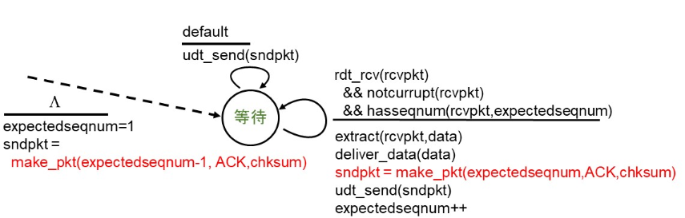

##### 等待退出线程

为了防止在断开连接时接收端的 ACK 信号出现丢包或延迟等情况，接收端需要等待 2\*RTO 的时间，以能接收到发送端因没收到 ACK 信号而超时重传的 FIN、ACK 信号。

当接收端的主线程接收到 FIN、ACK 信号时，会创建一个`waitExit`线程进入等待状态，然后主线程会继续接收发送端的消息（**对于本程序，此时仅可能接收到发送端重传的 FIN、ACK 信号**），每次接收消息时会将`exitTime`重新清零，当 exitTime 超过了 2 \* RTO 时，则会终止接收端的所有线程。

```cpp
DWORD WINAPI waitExit(LPVOID lpParam) {
    // 循环等待退出时间达到指定条件
    while (true) {
        Sleep(1);    // 暂停线程执行
        exitTime++;  // 增加退出计时器

        // 如果退出计时器达到两倍的超时时间
        if (exitTime >= 2 * RTO) {
            // 执行退出操作
            printf("[LOG] Wave hand successfully!\n");
            closesocket(clientSocket);  // 关闭接收端套接字
            WSACleanup();               // 清理 Winsock 资源
            exit(0);                    // 退出程序
        }
    }

    // 该部分代码不会被执行，添加是为了防止warning
    return 0;
}
```

##### 接收消息线程（主线程）

下列函数实现了接受消息的功能，并将接收到的文件通过`fstream`存储在磁盘中。其实现逻辑如下：

- **接收消息**：在主循环中，代码通过 UDP 套接字 `recvfrom` 函数接收从发送端传来的消息，其中 `recvBuffer` 是接收消息的缓冲区。接收到的消息可能包含不同类型的信息，包括**握手信号（SYN）、文件头（FHD）、挥手信号（FIN、 ACK）以及文件数据**。

- **验证消息**：接收到消息之后，首先要验证消息的[校验和](#校验和)和序列号，当不正确时则重传一个上一状态的信号，即`prevSeq(expectedSeq)`。

- **握手消息**：当接收到 SYN 时，接收端向发送端发送 ACK 和 SYN，以建立连接。

- **挥手消息**：当接收到 FIN、 ACK 时，接收端向发送端发送 ACK，并进行退出等待。在第一次接收到 FIN 时，创建一个退出等待的线程，并**不阻塞主线程**，主线程继续接受发送端可能重传的 FIN、ACK 信号，接收到时则重置等待时间，直到等待时间大于 `2 * RTO`， 结束接收端的所有线程。

- **文件描述消息**：当接收到包含文件头的消息时，从消息中提取文件描述符，包括文件名和文件大小。随后，接收端创建一个新文件并将接收到的文件数据写入文件。

- **普通数据消息**：当接收到普通数据包时，将数据写入文件，并发送 ACK 给发送端。如果文件接收完成，关闭文件。

该函数通过验证消息的校验和和序列号，确保了消息的可靠性。根据消息类型的不同，执行相应的操作，包括建立连接、接收文件头和文件数据、发送 ACK，并处理退出等待。在接收过程中，通过向发送端发送 ACK，保证了数据传输的可靠性和完整性。

```cpp
void beginRecv() {
    while (true) {
        // 从接收端套接字接收消息
        int serverAddressLength = sizeof(SOCKADDR);
        int recvLength =
            recvfrom(clientSocket, (char*)&recvBuffer, sizeof(Message), 0,
                     (sockaddr*)&serverAddr, &serverAddressLength);
        // 检测是否接收成功
        if (recvLength == -1)
            exit(0);
        // 验证消息的校验和，且序列号与期望序列号相等
        if (recvBuffer.checksumValid(&recvPseudoHeader) &&
            recvBuffer.seq == expectedSeq) {
            if (recvBuffer.getFlag(SYN)){
                // 如果消息是SYN, 向发送端发送ACK和SYN
                (sendFlag(expectedSeq, ACK | SYN))
            } else if (recvBuffer.getFlag(FIN | ACK) == (FIN | ACK)) {
                // 如果消息是FIN, 向发送端发送FIN|ACK
                sendFlag(expectedSeq, FIN | ACK);
                exitTime = 0;
                // 等待退出
                if (!beginExit) {
                    beginExit = true;
                    HANDLE myWaitThread =
                        CreateThread(NULL, 0, waitExit, NULL, 0, 0);
                }
            } else {// 如果消息包含数据
                if (recvBuffer.getFlag(FHD)) {// 如果消息包含文件头
                    // 从消息中提取文件描述符
                    FileDescriptor fileDescriptor;
                    memcpy(&fileDescriptor, recvBuffer.data,
                           sizeof(FileDescriptor));
                    // 设置文件大小和文件名
                    fileSize = fileDescriptor.fileSize;
                    filename = fileDir + "/" + fileDescriptor.fileName;
                    currentSize = 0;
                    // 创建文件
                    ofs.open(filename, ios::out | ios::binary | ios::trunc);
                } else { //如果包含数据，则写入文件
                    ofs.write((char*)recvBuffer.data, recvBuffer.getLen());
                    currentSize += recvBuffer.getLen();
                }
                // 向发送端发送ACK
                sendFlag(expectedSeq, ACK);
            }
            // 更新当前的期望序列号
            expectedSeq = nextSeq(expectedSeq);
        } else {
            // 如果数据包无效或者接收序列号与当前序列号不相等，需要重新发送上一个ack
            if (recvBuffer.getFlag(SYN)) {
                sendFlag(prevSeq(expectedSeq), ACK | SYN);
            } else {
                sendFlag(prevSeq(expectedSeq), ACK | recvBuffer.getFlag(FIN));
            }
        }
    }
}
```

## 实验结果

### 日志分析

下面我将最大报文段长度设为 4000，丢包率设为 2%，超时重传时间设为 5ms，窗口大小设为 4，seq 的位数设为 16，发送`1.jpg`文件，得到如下结果

```cpp
#define MSS 4000                 // 最大报文段长度
#define LOSS_RATE 2              // 丢包率
#define RTO 5                    // 等待时间
#define WIN_SIZE 4               // 窗口大小
#define SEQ_BITS 16              // 存储seq的位数
```

#### 1. 两次握手

<center>发送端两次握手日志</center>

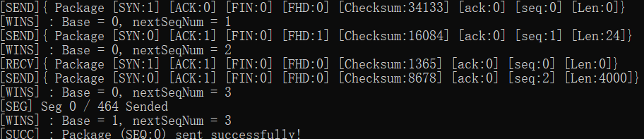

<center>接收端两次握手日志</center>

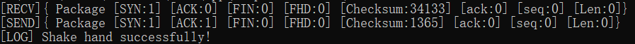

**发送端**：可以看到发送端首先发送了一个 `SYN `消息，并且状态位 seq 为 0，然后窗口变为[0, 1]。由于使用 GBN 协议，发送端在等待第一条消息的 ACK 时仍然发送了其他消息，在接收到 ACK 消息后，窗口变为[1, 3]，输出包传递成功，并输出成功握手。

**接收端**：接收端接收到该消息，并发送了一个`SYN | ACK`信号，ack 同样为 0，并在没发生丢包的情况下输出`Shake hand successfully!`。

### 2. 传送文件描述结构体

<center>发送端传送文件描述结构体日志</center>

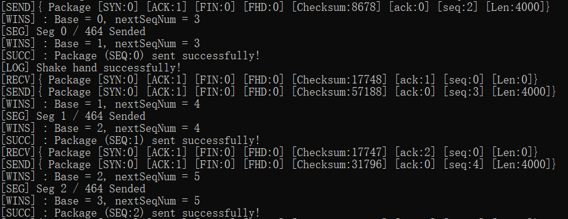

<center>接收端传送文件描述结构体日志</center>

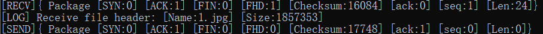

**发送端**：可以看到发送端首先发出一个标志位为`ACK | FHD`的消息，seq 为 1，发送端在等待该条 ACK 消息时仍然正常进行了发送与接收，接收到该 ACK 消息后，将窗口更新为[2, 4]，并输出包传递成功。

**接收端**：接收端接收到该消息，输出接收到的文件名称为`1.jpg`，文件大小为`1857353`字节，并发送了一个`ACK`消息，ack 为 1。

### 3. 传递数据

<center>发送端传递数据日志</center>

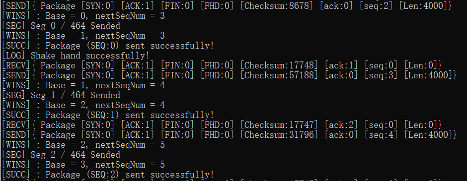

<center>接收端传递数据日志</center>

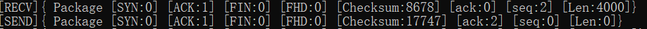

**发送端**：发送端首先发出一个标志位为`ACK`的消息，seq 为 2，报文段长度为 4000，发送端在等待该条 ACK 消息时仍然正常进行了发送与接收，接收到该 ACK 消息后，将窗口更新为[3, 5]，并输出包传递成功。

**接收端**：接收端接收到该消息, 发送了一个`ACK`消息，ack 为 2。

### 4. 超时重传

<center>发送端超时重传日志</center>

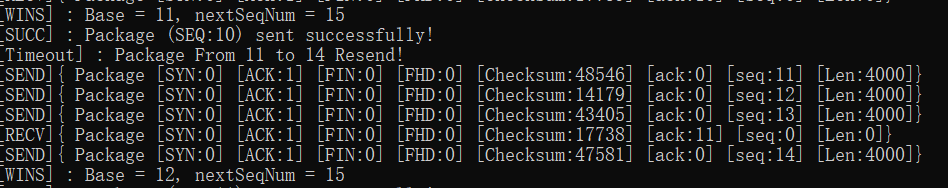

<center>接收端超时重传日志</center>

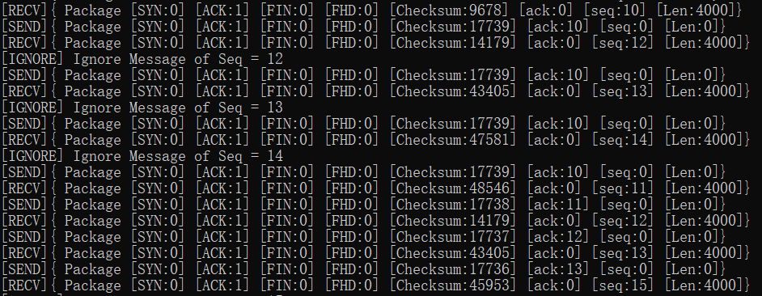

**发送端**：可以看到发送端对于 seq=11 的消息出现了 Timeout，发送端触发重传，将当前发送缓冲区中的所有消息，即 seq=11 到 seq=14 的消息全部重新发送，发送前的窗口为[11, 15]，而由于中间接收到了 seq=11 消息的 ACK，所以重发后窗口变为[12, 15]。

**接收端**：接收端在收到 seq=10 的消息后下一条消息为 seq=12，说明 seq=11 的消息发生了丢失，所以忽略了之后传来的所有不对的消息，并等待发送端超时重传。直到接收到 seq=11 的消息后继续进行接收。

### 5. 文件传输完成

<center>发送端文件传输完成日志</center>

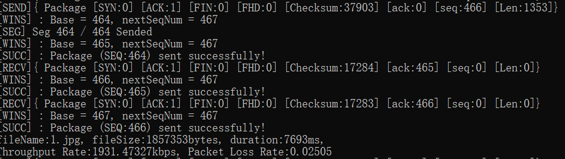

<center>接收端文件传输完成日志</center>

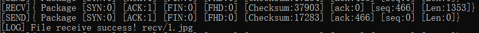

**发送端**：可以看到最后一条数据消息的 seq=466，报文段长度为 1353，这正是`1857353`(文件总大小)相对于`4000`(MSS)的余数。发送端在等待该条 ACK 消息时仍然正常进行了发送与接收，接收到该 ACK 消息后，将窗口更新为[467, 467]，输出包传递成功，并输出性能。如**传输时间为 7693ms，吞吐率为 1931.473kbps，丢包率为 0.025**。

**接收端**：接收端在收到 seq=466 的消息后发送一条 ack=466 的 ACK 消息，并输出成功接收到了 1.jpg 文件。

### 6.两次挥手

<center>发送端两次挥手日志</center>

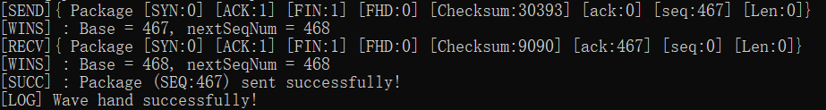

<center>接收端两次挥手日志</center>

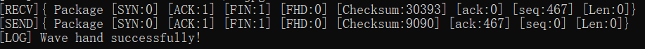

**发送端**：发送端首先发送一个 `ACK | FIN `消息，并且状态位 seq 为 467，发送端接收到该消息的 ACK 之后后，输出包传递成功，并输出成功挥手，然后结束发送进程。

**接受端**：接收端接收到发送端的`FIN|ACK`消息后，回复一个`FIN|ACK`信号，ack 为 467，并在**等待 2 \* RTO 的情况下**输出`Wave hand successfully!`，断开链接，结束接受进程。

### 性能对比分析

下面将 WIN_SIZE 设为 16，对`lab3-1`和`lab3-2`两个实验进行对比分析。

#### lab3-1 性能

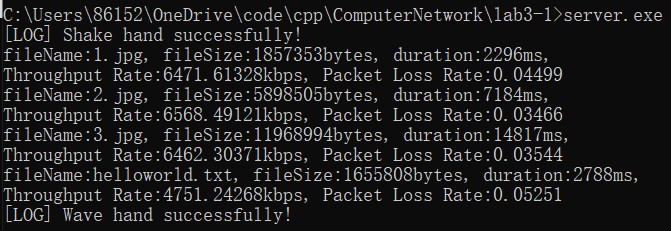

| 文件名         | 文件大小 (bytes) | 时延 (ms) | 吞吐率 (kbps) |
| -------------- | ---------------- | --------- | ------------- |
| 1.jpg          | 1,857,353        | 2,296     | 6,471.61      |
| 2.jpg          | 5,898,505        | 7,184     | 6,568.49      |
| 3.jpg          | 11,968,994       | 14,817    | 6,462.30      |
| helloworld.txt | 1,655,808        | 2,788     | 4,751.24      |

#### lab3-2 性能

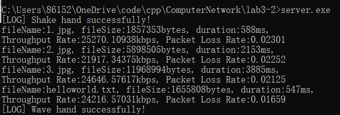

| 文件名         | 文件大小 (bytes) | 时延 (ms) | 吞吐率 (kbps) |
| -------------- | ---------------- | --------- | ------------- |
| 1.jpg          | 1,857,353        | 600       | 24,764.71     |
| 2.jpg          | 5,898,505        | 1,915     | 24,641.27     |
| 3.jpg          | 11,968,994       | 3,890     | 24,614.90     |
| helloworld.txt | 1,655,808        | 495       | 26,760.53     |

由上述结果可知，Lab3-2 在加入 GBN 协议和累计确认后对传输图片的时延提高了 3-4 倍，对传输 txt 文件的时延提高了 5 倍多，表明了 GBN 协议的性能优势和本人实现代码的正确性。
