# **lab3-3：选择确认**

> 姓名: 王茂增\
> 学号: 2113972\
> 代码: https://github.com/mzwangg/ComputerNetwork

## **实验要求**

在实验3-1的基础上，将停等机制改成基于滑动窗口的流量控制机制，发送窗口和接收窗口采用相同大小，支持**选择确认**，完成给定测试文件的传输。

1. 协议设计：**数据包格式，发送端和接收端交互**，详细完整

2. 流水线协议：**多个序列号**

3. 发送缓冲区、接收缓冲区

4. 选择确认：**SR(Selective Repeat)**

5. 日志输出：收到/发送数据包的**序号、ACK、校验和等**，发送端和接收端的
   窗口大小等情况，传输时间与吞吐率

6. 测试文件：必须使用助教发的测试文件（1.jpg、2.jpg、3.jpg、helloworld.txt）

**评分标准（总分 100 分）**：协议设计、功能实现（30 分）、演示并讲解（30 分）、程序及规范性（20 分）、实验报告（20 分）

## **实验环境**

在 windows10 下使用 `g++` 编译得到可执行文件，编译命令如下：

```
g++ client.cpp -o client.exe -lws2_32
g++ server.cpp -o server.exe -lws2_32
```

## **程序简介**

1. 由于仅需服务器向客户端发送数据，故使用**两次握手**和**两次挥手**进行连接建立和连接关闭。

2. 使用**RTO+1**个集合记录每个毫秒加入的序列号，每经过一毫秒则检查**最老集合**是否确认收到，实现**使用一个线程对每个分组分别计时**。

3. 使用类似**循环队列**的结构作为发送缓冲区和接收缓冲区。

4. 使用**mutex**保护发送缓冲区，防止在多线程环境下出现错误。

5. 发送端共有 3 个线程，包括**消息接收线程**、**消息发送线程**和**超时重传线程**。

6. 接收端共有 2 个线程，包括**消息接收/发送线程**和**等待退出线程**。

## **协议设计及实现**

### **1.数据包格式**

对于数据包的设计，我使用了常见的 TCP 协议中的一些字段，例如源端口、目的端口、确认号、序列号等，并额外添加了一些自定义标志，如文件描述标志 `FHD`。这样的设计可以支持基本的连接建立、数据传输和连接关闭操作。消息设计如下：

```cpp
struct Message {
    uint16_t sourcePort;         // 源端口
    uint16_t destinationPort;    // 目的端口
    uint16_t ack;                // ack
    uint16_t seq;                // seq
    uint16_t flagAndLength = 0;  // ACK(15)|SYN(14)|FIN(13)|FHD(12)|LEN(11-0)
    uint16_t checksum;           // 校验和
    uint8_t data[MSS];           // 数据段
}
```

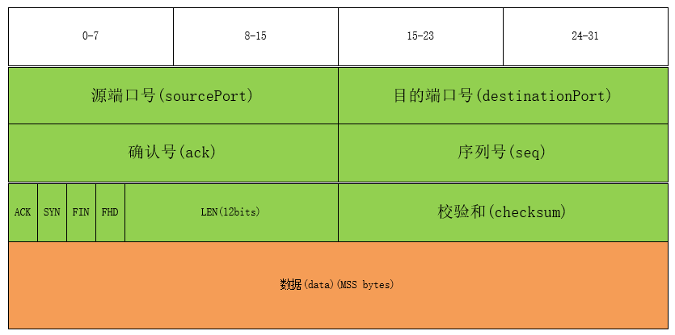

这是一个基于 UDP 协议的简化消息数据包设计，每个消息包含以下字段：

- `sourcePort`（源端口）：占用 16 位，表示消息的源端口号。

- `destinationPort`（目的端口）：占用 16 位，表示消息的目的端口号。

- `ack`（确认号）：占用 16 位，会在发送确认消息时使用。

- `seq`（序列号）：占用 16 位，会在发送数据消息时使用。

- `flagAndLength`（标志和长度）：占用 16 位，按位划分为 ACK(15)、SYN(14)、FIN(13)、FHD(12) 和 LEN(11-0)。

  - `ACK`（确认标志）：用于指示消息是否是确认消息。

  - `SYN`（同步标志）：用于建立连接的握手阶段。

  - `FIN`（结束标志）：用于连接的关闭阶段。

  - `FHD`（文件描述标志）：用于指示消息携带文件描述信息。

  - `LEN`（长度）：占用 12 位，表示消息数据段的长度。

- `checksum`（校验和）：占用 16 位，用于校验消息的完整性。

- `data`（数据段）：占用 MSS（最大报文段长度），用于存储消息的实际数据。

### **2.伪首部格式**

对于伪首部，同样参考了 TCP 的伪首部设计，其中包含了源 IP 地址，目的 IP 地址，zero，协议号，以及数据报的长度。

```cpp
class PseudoHeader {
    uint32_t sourceIP;       // 源IP
    uint32_t destinationIP;  // 目的IP
    uint8_t zero;            // 0
    uint8_t protocol;        // 协议
    uint16_t length;         // 报文长度
};
```

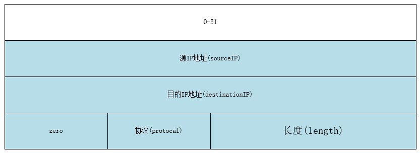

这是一个用于 TCP 协议校验和计算的伪首部结构体设计。伪首部是用于计算校验和的附加数据结构，它包含了 IP 层和 TCP 层报文头中的一些字段。

- `sourceIP`（源 IP 地址）：占用 32 位，表示消息的源 IP 地址。

- `destinationIP`（目的 IP 地址）：占用 32 位，表示消息的目的 IP 地址。

- `zero`：占用 8 位，用于填充字节，目前无特定功能。

- `protocol`（协议）：占用 8 位，表示上层协议的类型，这里使用 13，表示 UDP 协议。

- `length`（长度）：占用 16 位，表示报文的长度。

该伪首部的主要目的是在计算 TCP 报文校验和时，将 TCP 报文头和数据部分加入计算，以增加校验的准确性。这是因为校验和算法需要覆盖整个数据报文，包括 TCP 报文和 IP 报文头。

### **3.建立、断开链接**

由于本实验仅需实现**单向通信**，即发送端向接收端的发送，所以对 TCP 的三次握手和四次挥手进行了一定的简化，使用**两次握手**和**两次挥手**建立、断开链接。

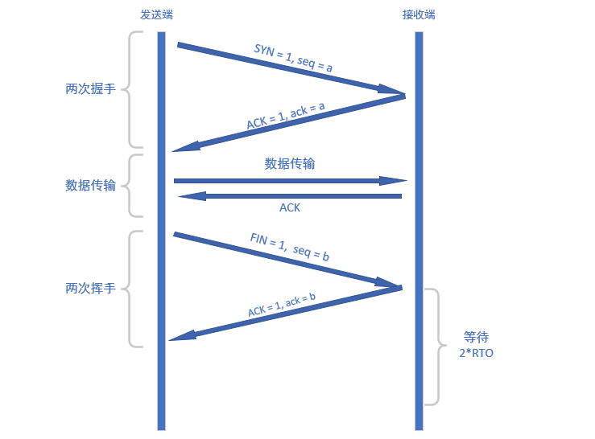

#### **两次握手:**

1. **发送端发送连接请求（SYN）：**

   - 发送端向接收端发送一个带有 `SYN`（同步）标志的连接请求报文，并将报文的 `seq` 设为当前的 `nextSeqNum`(下一个序列号) 。

2. **接收端响应（ACK）：**

   - 接收端收到发送端的连接请求后，如果成功连接则返回一个ACK，并将ack设为SYN消息的seq。

#### **两次挥手:**

1. **发送端发送连接终止请求（FIN）：**

   - 发送端完成数据传输后，向接收端发送一个带有 `FIN`（结束）标志的报文。发送端进入半关闭状态，在收到接收端对应的 `ACK` 后进入关闭状态。

2. **接收端响应（ACK）：**

   - 接收端收到发送端的连接终止请求后，如果已经成功接收完文件，则发送ACK报文表示已收到发送端的 FIN， 并在等待两个 `RTO` 之后关闭。

### **4.校验和**

**`uint16_t Message::calChecksum(PseudoHeader* pseudoHeader)`：**

   - 该函数使用累加和算法计算伪首部和消息数据的校验和。
   - 累加和算法遍历伪首部和消息数据的每个 16 位块，将它们相加，并将进位加到后面。返回计算得到的 16 位校验和。

   ```cpp
   // 计算校验和的函数，传入伪首部指针作为参数
   uint16_t Message::calChecksum(PseudoHeader* pseudoHeader) {
       uint32_t sum = 0;
       // 计算伪首部的校验和
       for (int i = 0; i < sizeof(PseudoHeader) / 2; i++) {
           sum += ((uint16_t*)pseudoHeader)[i];
           sum = (sum & 0xffff) + (sum >> 16);
       }
       // 计算数据的校验和
       for (int i = 0; i < sizeof(Message) / 2; i++) {
           sum += ((uint16_t*)this)[i];
           sum = (sum & 0xffff) + (sum >> 16);
       }
       return (uint16_t)sum;
   }
   ```

### **5.缓冲区**

- **WindowsItem类**：该类作为发送缓冲区的基本单位，由Message和指示是否确认接受的`bool`类型变量`isRecved`组成。

- **Windows**：该类用于**实现发送缓冲区和接收缓冲区**，参照了**循环队列**的结构，使用数组存储缓冲的消息，使用`begin`和`end`指示起始位置和结束位置，并为了方便，使用了`base`记录下滑动窗口的`base`。具体成员函数见代码。

```cpp
struct WindowsItem {
    Message message;
    bool isRecved;
};

class Windows {
public:
    int begin;                     // 起始位置的索引
    int end;                       // 结束位置的索引
    uint16_t base;                 // 滑动窗口的base
    WindowsItem buffer[MAX_SIZE];  // 存储数据包的缓冲区
}
```

### **6.选择重传**

#### **发送端**

##### **1)、发送端超时重传线程**

由于选择重传要求给每一个分组单独计时，但是给每个分组新建一个线程计时的话会造成较大的性能开销，所以我使用**RTO+1**个集合记录每个毫秒加入的序列号，每经过一毫秒则检查**最老集合**是否确认收到，实现**使用一个线程对每个分组分别计时**。

首先建立全局变量timerArr和timerIndex，分别存储着数据包在发送缓冲区的索引和最新集合的下标。

```cpp
// 超时计时器数组， 存储着数据包在发送缓冲区的索引
set<pair<int, int>> timerArr[RTO + 1];  
// 指向最新的集合，它的下一个集合为最老的集合
int timerIndex = 0;
```

然后，在超时重传线程中，每经过1ms，我们遍历下标为`(timerIndex + 1) % (RTO + 1)`的集合，即**最老集合**，判断是否接收到，如果没接收到则重传并将其重新加入下标为`timerIndex`的集合，即**最新集合**，最后将`timerIndex`加一，更新最新集合和最老集合的位置。**(对于resendThread线程我去除了部分代码，只展示主要部分，详见server.cpp)**

```cpp
DWORD WINAPI resendThread() {
    while (true) {
        Sleep(1);  // 休眠1毫秒

        //遍历最老集合的数据包，重发还未确认的消息
        std::lock_guard<std::mutex> lockGuard(bufferMutex);
        oldestSet = &timerArr[(timerIndex + 1) % (RTO + 1)];
        for (auto it = oldestSet->begin(); it != oldestSet->end(); ++it) {
            tempItem = sendBuffer.buffer + it->first;//找到相应的缓冲区元素
            if (!tempItem->isRecved && it->second >= base) {//如果该数据包还没接收
                timerArr[timerIndex].insert(*it); // 在最新的集合加入该数据包的索引
                sendto(serverSocket, (char*)(tempItem), sizeof(Message), 0,
                    (sockaddr*)&clientAddr, sizeof(SOCKADDR_IN));// 发送数据包
            }
        }

        // 更新timerIndex到最新的集合并清空
        timerIndex = (timerIndex + 1) % (RTO + 1);
        timerArr[timerIndex].clear();
    }
}
```

通过上述步骤，实现了使用一个线程对每个分组分别计时。虽然会存在1ms的误差，但是超时重传对1ms的误差并不敏感，并且这样比使用多个线程分别计时节省了很多服务器资源。

##### **2)、发送端接收消息线程**

对于接收消息线程，我们接收到消息之后，判断该消息是否在发送缓冲区中且还没确认接受，如果是，则标记该数据包已经接收，然后锁定缓冲区，将缓冲区中最前方的已经确认接收的消息通过`while`循环不断`pop`出来，并增加`base`，直到遇到未接收的数据包。并且该线程会在接收到`FIN`消息后退出。**(对于recvThread线程我去除了部分代码，只展示主要部分，详见server.cpp)**

```cpp
DWORD WINAPI recvThread() {
    while (true) {
        recvfrom(serverSocket, (char*)&tempMessage, sizeof(Message), 0,
                    (sockaddr*)&clientAddr, &clientAddressLength);

        // 检查校验和以及是否该消息还没ACK
        tempItem = sendBuffer.getItem(tempMessage.ack);
        if (tempMessage.checksumValid(&recvPseudoHeader) && tempItem &&
            !tempItem->isRecved) {
            tempItem->isRecved = true;// 标记该数据包已经接收

            // 将已经接收的数据包弹出，直到遇到未接收的数据包
            lock_guard<mutex> lockGuard(bufferMutex);
            while (tempItem = sendBuffer.pop()) {
                base++;// 增加base
                if (tempItem->message.getFlag(FIN)) {
                    return 0;
                }
            }
        }
    }
}
```

##### **3)、发送端发送消息线程**

本程序使用主线程发送消息，其主要分为两个函数，`sendFiles`用于发送文件，并会在内部构造 Message 并调用`sendMessage`发送普通消息。

- **sendFiles**

该函数是用于发送指定的文件，其运行逻辑如下：

1. **遍历文件**：遍历给定的文件名数组，对每个文件执行以下操作：
   
2. **读取文件**：打开文件并获取文件大小，将文件描述结构体的 `file.name`更新为当前文件名，将`file.fileSize`更新为文件大小。
   
3. **发送文件描述消息**：发送包含文件名和大小的文件描述消息，将`FHD`置为 1，通过 `sendMessage` 函数发送。
   
4. **发送文件内容**：发送文件内容，首先根据文件大小计算需要多少个报文来发送文件内容。针对文件内容按照 MSS 大小通过`sendMessage`进行分段发送。
   
5. **等待发送完毕**：等待发送缓冲区为空，确保文件内容完全发送。。

整体来说，该函数通过逐一发送文件描述消息和文件内容分段，确保文件的完整发送。发送过程中使用 `sendBuffer` 缓冲区来管理已发送和待发送的数据包。

```cpp
// 发送文件的函数，根据文件名数组和数量发送文件内容
void sendFiles(const char* fileNameArr[], int size) {
    for (int i = 0; i < size; i++) {// 遍历文件名数组
        // 更新文件名
        strcpy(file.fileName, fileNameArr[i]);
        // 打开文件并获取文件大小
        ifstream ifs(fileDir + "/" + file.fileName,
                     ios::binary | ios::ate | ios::app);
        file.fileSize = ifs.tellg();
        ifs.seekg(0, ios::beg);
        // 发送包含文件名和大小的文件描述消息
        sendMessage(FHD, sizeof(FileDescriptor), (char*)&file);
        // 按段发送文件内容
        int segments = (file.fileSize + MSS - 1) / MSS;
        int len = file.fileSize;
        for (int i = 0; i < segments; i++) {
            char fileContent[MSS];
            ifs.read(fileContent, min(len, MSS));
            sendMessage(ACK, min(len, MSS), fileContent);
            len -= MSS;
        }
        // 等待发送完毕
        while (!sendBuffer.isEmpty())
            Sleep(1);
    }
}
```

- **sendMessage**

这个函数用于构造并发送消息。其实现逻辑如下：

1. **等待空位**: 通过`sendBuffer.isFull()`检测发送缓冲区是否已满：如果已满，则等待`1ms`后继续检测；如果未满，则执行下面的代码。

2. **更新发送缓冲区**：首先通过互斥锁保护，获取下一个空位置的消息指针，并将该位置的下标和序列号加入最新集合，并更新消息内容。

3. **发送消息**：然后，根据设定的丢包率模拟丢包情况，通过套接字发送消息。

4. **更新状态**：最后，更新窗口下标。

```cpp
void sendMessage(uint16_t flags, uint16_t dataSize, char* dataPtr) {
    // 等待发送缓冲区有空余位置
    while (sendBuffer.isFull()) {
        Sleep(1);
    }

    // 构建消息的发送缓冲区
    lock_guard<mutex> lockGuard(bufferMutex);
    WindowsItem* item = sendBuffer.nextEmpty();
    Message* message = &(item->message);
    timerArr[timerIndex].insert(
        make_pair(sendBuffer.getIndex(item), nextSeqNum));  // 插入到超时队列
    // 更新消息内容，包括目的端口、源端口、序列号、标志位、数据大小、数据指针等信息
    message->update(SERVER_PORT, CLIENT_PORT, 0, nextSeqNum, flags, dataSize,
                    dataPtr, &sendPseudoHeader);

    // 通过套接字发送消息
    sendto(serverSocket, (char*)message, sizeof(Message), 0,
           (sockaddr*)&clientAddr, sizeof(SOCKADDR));
    
    //更新窗口下标
    nextSeqNum++;
}
```

#### **接收端**

##### **1)、接收端等待退出线程**

为了防止在断开连接时接收端的 ACK 信号出现丢包或延迟等情况，接收端需要等待 2\*RTO 的时间，以能接收到发送端因没收到 ACK 信号而超时重传的 FIN、ACK 信号。

当接收端的主线程接收到 FIN 信号时，会创建一个`waitExit`线程进入等待状态，然后主线程会继续接收发送端的消息（**对于本程序，此时仅可能接收到发送端重传的 FIN、ACK 信号**），每次接收消息时会将`exitTime`重新清零，当 exitTime 超过了 2 \* RTO 时，则会终止接收端的所有线程。

```cpp
DWORD WINAPI waitExit(LPVOID lpParam) {
    while (true) { // 循环等待退出时间达到指定条件
        Sleep(1);    // 暂停线程执行
        exitTime++;  // 增加退出计时器
        if (exitTime >= 2 * RTO) { // 如果退出计时器达到两倍的超时时间，则退出
            closesocket(clientSocket);  // 关闭接收端套接字
            WSACleanup();               // 清理 Winsock 资源
            exit(0);                    // 退出程序
        }
    }
}
```

##### **2)、接收端接收消息线程**

下列函数实现了接受消息的功能，并将接收到的文件通过`fstream`存储在磁盘中。其实现逻辑如下：

- **接收消息**：在主循环中，代码通过 UDP 套接字 `recvfrom` 函数接收从发送端传来的消息，其中 `recvBuffer` 是接收消息的缓冲区。接收到的消息可能包含不同类型的信息，包括**握手信号（SYN）、文件头（FHD）、挥手信号（FIN）以及文件数据**。

- **发送确认**：如果接收到的消息不是FIN且检验和正确，则发送对应的确认消息。如果是FIN的话，需要等到处理完全部包之后再发送ACK，否则由于丢包，发送端可能会先关闭，而接收端还没接收完毕。

- **验证消息**：接收到消息之后，首先要验证消息的[校验和](#4校验和)、是否应该在接收缓冲区中、是否还没接收，当有一个不满足时则跳过该消息，否则将该消息复制到接收缓冲区的对应位置。

- **弹出消息**：通过`while`循环不断弹出接收缓冲区头部已经接收的消息，并进行下列处理，直到遇到第一个还没接收的消息。
 
- **挥手消息**：当接收到 FIN 时，接收端向发送端发送 ACK，并进行退出等待。在第一次接收到 FIN 时，创建一个退出等待的线程，并**不阻塞主线程**，主线程继续接受发送端可能重传的 FIN 信号，接收到时则重置等待时间，直到等待时间大于 `2 * RTO`， 结束接收端的所有线程。

- **文件描述消息**：当接收到包含文件头的消息时，从消息中提取文件描述符，包括文件名和文件大小。随后，接收端创建一个新文件并将接收到的文件数据写入文件。

- **普通数据消息**：当接收到普通数据包时，将数据写入文件，并发送 ACK 给发送端。如果文件接收完成，关闭文件。

该函数通过验证消息的校验，确保了消息的可靠性。根据消息类型的不同，执行相应的操作，包括建立连接、接收文件头和文件数据、发送 ACK，并处理退出等待。在接收过程中，通过向发送端发送 ACK，保证了数据传输的可靠性和完整性。

```cpp
void beginRecv() {
    while (true) {
        // 从客户端套接字接收消息
        int serverAddressLength = sizeof(SOCKADDR);
        int recvLength =
            recvfrom(clientSocket, (char*)&tempMessage, sizeof(Message), 0,
                     (sockaddr*)&serverAddr, &serverAddressLength);

        // 如果不是FIN且检验和正确，则发送ACK，表明接收到该消息
        if (tempMessage.checksumValid(&recvPseudoHeader) &&
            !tempMessagePtr->getFlag(FIN))
            sendFlag(tempMessage.seq, ACK);

        // 校验和正确，且该消息能放在当前窗口，且还没被接收
        tempItemPtr = recvBuffer.getItem(tempMessage.seq);
        if (tempMessage.checksumValid(&recvPseudoHeader) && tempItemPtr &&
            !tempItemPtr->isRecved) {
            // 将接收到的消息加入到接收缓冲区
            tempItemPtr->isRecved = true;
            tempItemPtr->message = tempMessage;

            // 不断pop出接收缓冲区中最前面的消息，直到还没有接收到该消息
            while (tempItemPtr = recvBuffer.pop()) {
                // 从接收缓冲区中取出消息
                tempMessagePtr = &(tempItemPtr->message);
                tempItemPtr->isRecved = false;
                // 如果消息是FIN
                if (tempMessagePtr->getFlag(FIN)) {  // 如果消息是FIN
                    // 向服务器发送ACK
                    sendFlag(tempMessagePtr->seq, ACK);
                    exitTime = 0;
                    // 等待退出
                    if (!beginExit) {
                        beginExit = true;
                        HANDLE myWaitThread =
                            CreateThread(NULL, 0, waitExit, NULL, 0, 0);
                    }
                } else {  // 如果消息包含数据
                    if (tempMessagePtr->getFlag(FHD)) { // 如果消息包含文件头
                        // 从消息中提取文件描述符
                        FileDescriptor fileDescriptor;
                        memcpy(&fileDescriptor, tempMessagePtr->data,
                               sizeof(FileDescriptor));
                        // 设置文件大小和文件名
                        fileSize = fileDescriptor.fileSize;
                        filename = fileDir + "/" + fileDescriptor.fileName;
                        currentSize = 0;
                        // 创建文件
                        ofs.open(filename, ios::out | ios::binary | ios::trunc);
                    } else { // 写入文件
                        ofs.write((char*)tempMessagePtr->data,
                                  tempMessagePtr->getLen());
                        currentSize += tempMessagePtr->getLen();
                    }
                }
            }
        }
    }
}
```

### **7.时间测量**

为了更准确的测量传输时间,我首先进行`WARM_NUM`次热身，此时不记录时间，然后重复`REPEAT_NUM`次，并取平均值作为最终的传输时间，以避免偶然因素的干扰，使结果更具可靠性。

```cpp
for (int step = 0; step < (WARM_NUM + REPEAT_NUM); step++) {
    // 开始计时
    auto start = chrono::steady_clock::now();

    //传送文件......

    // 结束及时并计算耗时
    auto end = chrono::steady_clock::now();
    auto duration =
        chrono::duration_cast<chrono::milliseconds>(end - start)
            .count();

    // 如果热身完毕，开始增加计时
    if (step >= WARM_NUM) {
        time += duration;
        lossRate += (float)lossNum / sendNum;
    }
}
```

## **实验结果**

### **日志分析**

下面我将最大报文段长度设为 2000，丢包率设为 2%，超时重传时间设为 5ms，窗口大小设为 4，发送`1.jpg`文件，得到如下结果：

```cpp
#define MSS 2000                 // 最大报文段长度
#define LOSS_RATE 2              // 丢包率
#define RTO 5                    // 等待时间
#define WIN_SIZE 4               // 窗口大小
```

#### **1. 两次握手**

<center>发送端两次握手日志</center>

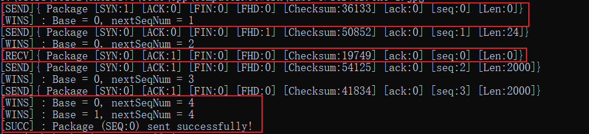

<center>接收端两次握手日志</center>

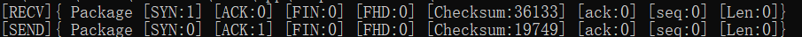

**发送端**：可以看到发送端首先发送了一个 `SYN `消息，并且状态位 seq 为 0，然后窗口变为[0, 1]。由于使用选择重传协议，发送端在等待第一条消息的 ACK 时仍然发送了其他消息，在接收到 ACK 消息后，窗口变为[1, 3]，输出包传递成功，并输出成功握手。

**接收端**：接收端接收到该消息，并发送了一个`SYN`信号，ack 为 0。

### **2. 传送文件描述结构体**

<center>发送端传送文件描述结构体日志</center>

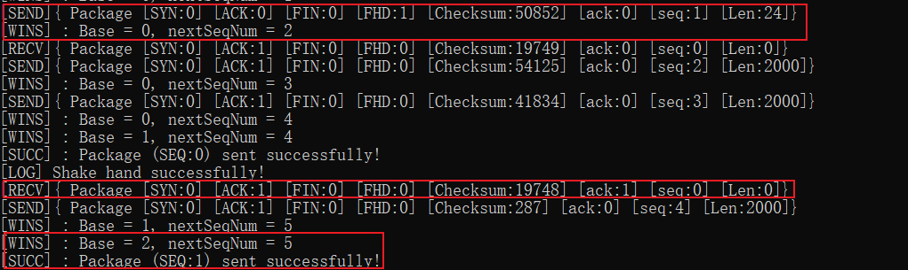

<center>接收端传送文件描述结构体日志</center>

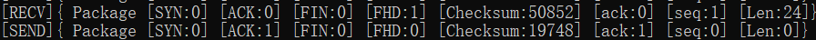

**发送端**：可以看到发送端首先发出一个标志位为`FHD`的消息，seq 为 1，发送端在等待该条 ACK 消息时仍然正常进行了发送与接收，接收到该 ACK 消息后，将窗口更新为[2, 5]，并输出包传递成功。

**接收端**：接收端接收到该消息，并发送了一个`ACK`消息，ack 为 1。

### **3. 传递数据**

<center>发送端传递数据日志</center>

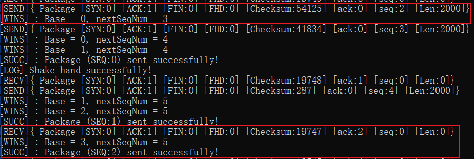

<center>接收端传递数据日志</center>

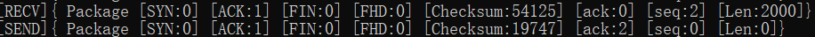

**发送端**：发送端首先发出一个标志位为`ACK`的消息，seq 为 2，报文段长度为 4000，发送端在等待该条 ACK 消息时仍然正常进行了发送与接收，接收到该 ACK 消息后，将窗口更新为[3, 5]，并输出包传递成功。

**接收端**：接收端接收到该消息, 发送了一个`ACK`消息，ack 为 2。

### **4. 超时重传**

<center>发送端超时重传日志</center>

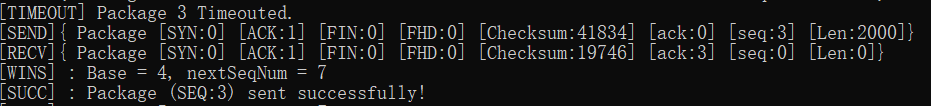

<center>接收端超时重传日志</center>

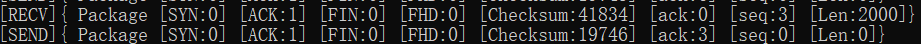

**发送端**：可以看到发送端对于 seq=3 的消息出现了 Timeout，发送端触发重传，重新发送该消息，并接收到了对应的ACK消息，随后窗口变为[4, 7]。

**接收端**：接收端接收到重传的消息, 发送了一个`ACK`消息，ack 为 3。

### **5.两次挥手**

<center>发送端两次挥手日志</center>

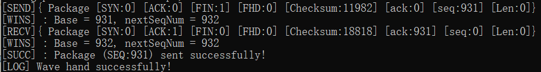

<center>接收端两次挥手日志</center>

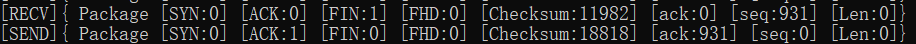

**发送端**：发送端首先发送一个 `FIN `消息，并且状态位 seq 为 931，发送端接收到该消息的 ACK 之后，输出包传递成功，并输出成功挥手，然后结束发送进程。

**接受端**：接收端接收到发送端的`FIN`消息后，回复一个`ACK`信号，ack 为 931，并在**等待 2 \* RTO 后**，断开连接，结束接受进程。

### **性能对比分析**

下面使用MSS等于2000，丢包率等于2、窗口大小等于16，RTO等于2作为基准，改变某个变量的值，对性能进行测量(其中吞吐率的单位为**kbps**，时延的单位为**ms**）：

#### **更改窗口大小**

| 文件名         | 时延(窗口:8) | 吞吐率(窗口:8) | 时延(窗口:32) | 吞吐率(窗口:32) |
| -------------- | ---------------- | ---------------- | ---------------- | ---------------- |
| 1.jpg          | 2200.000          | 6754.011         | 929.000           | 15994.429        |
| 2.jpg          | 6626.000          | 7121.648         | 2573.000          | 18339.697        |
| 3.jpg          | 13592.000         | 7044.729         | 5338.000          | 17937.795        |
| Helloworld.txt | 2117.000          | 6257.187         | 855.000           | 15492.940        |

由表格可知，窗口大小在由8变为32时，时延降低了两倍多，吞吐率提高了两倍多。这是由于我们可以同时发送更多的包，从而降低丢包和网络延迟对性能的影响。

#### **更改丢包率**

| 文件名         | 时延(丢包率:2%) | 吞吐率(丢包率:2%) | 时延(丢包率:5%) | 吞吐率(丢包率:5%) |
| -------------- | ----------------- | ------------------ | ----------------- | ------------------ |
| 1.jpg          | 1389.000          | 10697.497         | 2186.000          | 6797.266          |
| 2.jpg          | 3778.000          | 12490.217         | 5991.000          | 7876.488          |
| 3.jpg          | 8137.000          | 11767.476         | 12363.000         | 7745.042          |
| Helloworld.txt | 1402.000          | 9448.263          | 1799.000          | 7363.237          |

由表格可知，丢包率在由2%变为5%时，时延提高了大概一半，吞吐率降低了大概一半。这是由于丢失的包更多，导致超时重传的次数也更多，从而浪费了很多等待超时的时间，并且会发送更多的数据包。

#### **更改RTO**

| 文件名         | 时延(RTO:2) | 吞吐率(RTO:2) | 时延(RTO:5) | 吞吐率(RTO:5) |
| -------------- | ----------- | ------------ | ----------- | ------------ |
| 1.jpg          | 1389.000    | 10697.497    | 2256.000    | 6586.358     |
| 2.jpg          | 3778.000    | 12490.217    | 5884.000    | 8019.721     |
| 3.jpg          | 8137.000    | 11767.476    | 12828.000   | 7464.293     |
| Helloworld.txt | 1402.000    | 9448.263     | 2234.000    | 5929.482     |

由表格可知，RTO在由2%变为5%时，时延提高了大概一半，吞吐率降低了大概一半。这是由于超时重传等待了更久的时间，从而降低了性能。

#### **更改MSS**

| 文件名         | 时延(MSS=2000) | 吞吐率(MSS=2000) | 时延(MSS=4000) | 吞吐率(MSS=4000) |
| -------------- | -------------- | --------------- | -------------- | --------------- |
| 1.jpg          | 1389.000       | 10697.497      | 708.000        | 20987.039      |
| 2.jpg          | 3778.000       | 12490.217      | 1743.000       | 27072.887      |
| 3.jpg          | 8137.000       | 11767.476      | 4053.000       | 23624.957      |
| Helloworld.txt | 1402.000       | 9448.263       | 595.000        | 22262.965      |

由表格可知，MSS在由2000变为4000时，时延降低为了原来的一半，吞吐率提高了一倍。这是由于同样一条消息能发送更多的信息，从而减少了发送消息的总次数。
