# lab3-1：利用数据报套接字在用户空间实现面向连接的可靠数据传

> 姓名: 王茂增\
> 学号: 2113972\
> 代码: https://github.com/mzwangg/ComputerNetwork

## 实验要求

利用数据报套接字在用户空间实现面向连接的可靠数据传输，功能包括：**建立连接、差错检测、接收确认、超时重传**等。流量控制采用**停等机制**，完成给定测试文件的传输。

1. 数据报套接字：**UDP**

2. 协议设计：**数据包格式，发送端和接收端交互**，详细完整

3. 建立连接、断开连接：类似 TCP 的**握手、挥手**功能

4. 差错检验：**校验和**

5. 接收确认、超时重传：rdt2.0、rdt2.1、rdt2.2、**rtd3.0**等，亦可自行设计协议

6. 单向传输：发送端、接收端

7. 日志输出：收到/发送数据包的**序号、ACK、校验和**等，**传输时间与吞吐率**

8. 测试文件：必须使用助教发的测试文件（1.jpg、2.jpg、3.jpg、helloworld.txt）

**评分标准（总分 100 分）**：协议设计、功能实现（30 分）、演示并讲解（30 分）、程序及规范性（20 分）、实验报告（20 分）

## 实验环境

在 windows10 下使用 g++编译得到可执行文件，编译命令如下：

```
g++ client.cpp -o client.exe -lws2_32
g++ server.cpp -o server.exe -lws2_32
```

## 协议设计及实现

### 1.数据包格式

对于数据包的设计，我使用了常见的 TCP 协议中的一些字段，例如源端口、目的端口、确认号、序列号等，并额外添加了一些自定义标志，如文件描述标志 `FHD`。这样的设计可以支持基本的连接建立、数据传输和连接关闭操作。消息设计如下：

```cpp
struct Message {
public:
    // 成员变量
    uint16_t sourcePort;         // 源端口
    uint16_t destinationPort;    // 目的端口
    uint16_t ack;                // ack， 目前未使用
    uint16_t seq;                // seq, 目前仅使用最低位
    uint16_t flagAndLength = 0;  // ACK(15)|SYN(14)|FIN(13)|FHD(12)|LEN(11-0)
    uint16_t checksum;           // 校验和
    uint8_t data[MSS];           // 数据段
}
```

这是一个基于 UDP 协议的简化消息数据包设计，每个消息包含以下字段：

- `sourcePort`（源端口）：占用 16 位，表示消息的源端口号。

- `destinationPort`（目的端口）：占用 16 位，表示消息的目的端口号。

- `ack`（确认号）：占用 16 位，目前未使用。

- `seq`（序列号）：占用 16 位，目前仅使用最低位，表示消息的序列号。

- `flagAndLength`（标志和长度）：占用 16 位，按位划分为 ACK(15)、SYN(14)、FIN(13)、FHD(12) 和 LEN(11-0)。

  - `ACK`（确认标志）：用于指示消息是否是确认消息。

  - `SYN`（同步标志）：用于建立连接的握手阶段。

  - `FIN`（结束标志）：用于连接的关闭阶段。

  - `FHD`（文件描述标志）：用于指示消息携带文件描述信息。

  - `LEN`（长度）：占用 12 位，表示消息数据段的长度。

- `checksum`（校验和）：占用 16 位，用于校验消息的完整性。

- `data`（数据段）：占用 MSS（最大报文段长度），用于存储消息的实际数据。

### 2.伪首部格式

对于伪首部，同样参考了 TCP 的伪首部设计，其中包含了源 IP 地址，目的 IP 地址，zero，协议号，以及数据报的长度。

```cpp
// 伪首部结构体，用于校验和计算
class PseudoHeader {
public:
    uint32_t sourceIP;       // 源IP
    uint32_t destinationIP;  // 目的IP
    uint8_t zero;            // 0
    uint8_t protocol;        // 协议
    uint16_t length;         // 报文长度
};
```

这是一个用于 TCP 协议校验和计算的伪首部结构体设计。伪首部是用于计算校验和的附加数据结构，它包含了 IP 层和 TCP 层报文头中的一些字段。

- `sourceIP`（源 IP 地址）：占用 32 位，表示消息的源 IP 地址。

- `destinationIP`（目的 IP 地址）：占用 32 位，表示消息的目的 IP 地址。

- `zero`：占用 8 位，用于填充字节，目前无特定功能。

- `protocol`（协议）：占用 8 位，表示上层协议的类型，这里使用 13，表示 UDP 协议。

- `length`（长度）：占用 16 位，表示报文的长度。

该伪首部的主要目的是在计算 TCP 报文校验和时，将 TCP 报文头和数据部分加入计算，以增加校验的准确性。这是因为校验和算法需要覆盖整个数据报文，包括 TCP 报文和 IP 报文头。

### 3.建立、断开链接

由于本实验仅需实现单向的通信，即服务器向客户端的发送，所以对 TCP 的三次握手和四次挥手进行了一定的简化，使用**两次握手**和**两次挥手**建立、断开链接。

#### 两次握手:

1. **服务器发送连接请求（SYN）：**

   - 服务器向客户端发送一个带有 SYN（同步）标志的连接请求报文。

   - 服务器将当前的 state（状态）包含在报文中。

2. **客户端响应（ACK + SYN）：**

   - 客户端收到服务器的连接请求后，向服务器发送确认（ACK）和同步（SYN）标志的报文。

   - 客户端将当前的 state（状态）包含在报文中。

#### 两次挥手:

1. **服务器发送连接终止请求（FIN + ACK）：**

   - 服务器完成数据传输后，向客户端发送一个带有 FIN（结束）和 ACK(确认) 标志的报文。

   - 服务器进入半关闭状态，在收到客户端的 ACK 后进入关闭状态。

2. **客户端响应（ACK）：**

   - 客户端收到服务器的连接终止请求后，发送确认（ACK）标志的报文表示已收到服务器的 FIN。

### 4.可靠传输协议

本实验使用服务器作为发送端，客户端作为接收端，基于**rdt3.0**实现数据的可靠传输。其中，发送端和接收端均使用数据包中 seq 的最低位传输当前的状态，其他位暂未使用。

#### 校验和

对于检验和，我在`Message`类中实现了三个成员函数，下面分别进行介绍：

1. **`setChecksum(PseudoHeader* pseudoHeader)`：**

   - 该函数用于设置消息的校验和。

   - 首先，将消息的校验和 `checksum` 清零。

   - 然后，调用 `calChecksum` 函数计算校验和，并取其反码，将结果存储在 `checksum` 中。

   ```cpp
   // 设置校验和
   void setChecksum(PseudoHeader* pseudoHeader) {
       // 将checksum清零并计算校验和
       checksum = 0;
       checksum = ~calChecksum(pseudoHeader);
   }
   ```

2. **`bool checksumValid(PseudoHeader* pseudoHeader)`：**

   - 该函数用于判断消息的校验和是否有效。

   - 调用 `calChecksum` 函数计算校验和，如果等于 `0xFFFF`，则返回 `true` 表示校验和有效，否则返回 `false`。

   ```cpp
   // 判断校验和是否有效
   bool checksumValid(PseudoHeader* pseudoHeader) {
       // 判断校验和是否为0xFFFF
       return calChecksum(pseudoHeader) == 0xFFFF;
   }
   ```

3. **`uint16_t Message::calChecksum(PseudoHeader* pseudoHeader)`：**

   - 该函数用于计算消息的校验和。
   - 使用累加和算法计算伪首部和消息数据的校验和。
   - 累加和算法遍历伪首部和消息数据的每个 16 位块，将它们相加，并将进位加到后面。
   - 返回计算得到的 16 位校验和。

   ```cpp
   // 计算校验和的函数，传入伪首部指针作为参数
   uint16_t Message::calChecksum(PseudoHeader* pseudoHeader) {
       uint32_t sum = 0;

       // 计算伪首部的校验和
       for (int i = 0; i < sizeof(PseudoHeader) / 2; i++) {
           sum += ((uint16_t*)pseudoHeader)[i];
           sum = (sum & 0xffff) + (sum >> 16);
       }

       // 计算数据的校验和
       for (int i = 0; i < sizeof(Message) / 2; i++) {
           sum += ((uint16_t*)this)[i];
           sum = (sum & 0xffff) + (sum >> 16);
       }

       return (uint16_t)sum;
   }
   ```

#### 超时重传（服务器）

服务端每发送一个消息，就会新建一个`resendThread`线程， 并阻塞直到该线程结束。此时服务器存在两个线程，`ACK_FLAG`为一个全局变量，主线程用于接收客户端的`ACK`消息，并判断是否检验和和 seq 是否错误，若没错则将`ACK_FLAG`置为`true`，这样`resendThread`线程就会退出。

如果当前的等待时间大于超时时间，则可能出现了丢包的情况，此时需要重新发送该消息。

- **函数逻辑解析：**

  1. **等待 ACK：**

     - 使用一个 `while` 循环等待 ACK_FLAG 标志的设置。ACK_FLAG 是一个全局变量，表示是否收到了确认。

     - 如果 ACK_FLAG 被设置，表示已收到确认，跳出循环，函数结束。

  2. **超时计时：**

     - 如果 ACK_FLAG 未设置，进入内层 `while` 循环，每次等待 1 毫秒。

     - `waitTime` 记录等待的时间，超过规定的 RTO（超时时间）后，执行重发。

  3. **超时重发：**

     - 如果在规定的超时时间内未收到 ACK，执行重发操作。

     - 输出日志，打印消息的信息。

     - 增加发送包数量计数 `sendNum`。

     - 重置等待时间 `waitTime`。

     - 增加丢失包数量计数 `lossNum`。

  4. **模拟丢包：**

     - 模拟丢包情况，通过生成一个随机数，如果随机数小于丢包率 `LOSS_RATE`，则执行重发。

     - 如果随机数大于等于丢包率，表示不丢包，执行重新发送数据包的操作。

```cpp
DWORD WINAPI resendThread(Message* message) {
    // 如果 ACK_FLAG 没有设置，就继续计时，超时时重新发送
    int waitTime = 0;
    while (!ACK_FLAG) {
        // 等待超时时间，每次等待 1 毫秒
        while (waitTime < RTO && !ACK_FLAG) {
            Sleep(1);
            waitTime += 1;
        }
        if (!ACK_FLAG) {
            // 如果超时仍未收到确认，执行重发操作
            if (PRINT_LOG) {
                printf("[Timeout] : Resend Package\n[SEND]");
                message->printMessage();
            }

            sendNum += 1;  // 增加发送包数量计数
            waitTime = 0;  // 重置等待时间
            lossNum += 1;  // 增加丢失包数量计数

            // 模拟丢包情况
            if (rand() % 100 >= LOSS_RATE) {
                // 重新发送数据包
                sendto(serverSocket, (char*)message, sizeof(Message), 0,
                       (sockaddr*)&clientAddr, sizeof(SOCKADDR_IN));
            }
        }
    }
    return 0;
}
```

#### 退出等待（客户端）

为了防止在断开连接时客户端的 ACK 信号出现丢包或延迟等情况，客户端需要等待 2\*RTO 的时间，以能接收到服务器因没收到 ACK 信号而超时重传的 FIN、ACK 信号。

当客户端的主线程接收到 FIN、ACK 信号时，会创建一个`waitExit`线程进入等待状态，然后主线程会继续接收服务器的消息（**对于本程序，此时仅可能接收到服务器重传的 FIN、ACK 信号**），每次接收消息时会将`exitTime`重新清零，当 exitTime 超过了 2 \* RTO 时，则会终止客户端的所有线程。

```cpp
DWORD WINAPI waitExit(LPVOID lpParam) {
    // 循环等待退出时间达到指定条件
    while (true) {
        Sleep(1);    // 暂停线程执行
        exitTime++;  // 增加退出计时器

        // 如果退出计时器达到两倍的超时时间
        if (exitTime >= 2 * RTO) {
            // 执行退出操作
            printf("[LOG] Wave hand successfully!\n");
            closesocket(clientSocket);  // 关闭客户端套接字
            WSACleanup();               // 清理 Winsock 资源
            exit(0);                    // 退出程序
        }
    }

    // 该部分代码不会被执行，添加是为了防止warning
    return 0;
}
```

#### 发送端（服务器）


这部分代码基于 rdt3.0 的发送端的有限状态机实现了可靠发送消息的功能，其中涉及到发送消息、模拟丢包、创建重传线程、等待 ACK 的过程。下面是对代码的解释：

1. **发送消息：**

   - 如果没有丢包，将消息发送到客户端。否则不发送。

2. **创建重传线程：**

   - 使用 `CreateThread` 创建一个[重传线程](#超时重传服务器)，用于处理消息的重传。

3. **等待 ACK：**

   - 进入一个循环，不断接收来自客户端的消息，检查校验和与 seq。

   - 如果收到的 ACK 有效，表示消息成功发送和接收，将全局变量`ACK_FLAG`置为 true，以**停止重传线程**，并通过`WaitForSingleObject` 等待重传线程结束，然后**更新序列号**，**跳出循环**。

   - 如果收到的 ACK 无效，表示刚刚发送的数据包失败，**等待超时重新发送**。

```cpp
void sendPackage(Message message) {
    // 如果不随机丢包，发送消息到客户端
    ACK_FLAG = false;  // 设置 ACK_FLAG 为 false
    sendNum += 1;

    // 模拟丢包情况
    if (rand() % 100 >= LOSS_RATE) {
        sendto(serverSocket, (char*)&message, sizeof(Message), 0,
               (sockaddr*)&clientAddr, sizeof(SOCKADDR));
    }

    // 打印发送日志
    if (PRINT_LOG) {
        printf("[SEND]");
        message.printMessage();
    }

    // 创建重传线程
    HANDLE myResendThread = CreateThread(
        NULL, 0, (LPTHREAD_START_ROUTINE)resendThread, &message, 0, 0);

    // 然后等待 ACK
    while (true) {
        Message recvBuffer;
        int clientAddressLength = sizeof(SOCKADDR);
        int recvLength =
            recvfrom(serverSocket, (char*)&recvBuffer, sizeof(Message), 0,
                     (sockaddr*)&clientAddr, &clientAddressLength);

        // 检测是否接收成功
        if (recvLength == -1) {
            cerr << "[ERROR] : Package received from socket failed!\n";
            exit(0);
        }

        // 输出接收到的消息
        if (PRINT_LOG) {
            printf("[RECV]");
            recvBuffer.printMessage();
        }

        // 检查校验和和 ACK
        // 只有当校验和有效并且 ACK 是当前序列的，才表示数据包成功发送和接收
        if (recvBuffer.checksumValid(&recvPseudoHeader) &&
            recvBuffer.seq == state) {
            ACK_FLAG = true;

            // 等待重传线程结束
            WaitForSingleObject(myResendThread, INFINITE);

            // 更新当前序列
            state = (state + 1) & 1;

            // 当前发送任务完成
            if (PRINT_LOG) {
                printf("[LOG] : Package (SEQ:%d) sent successfully!\n",
                       recvBuffer.seq);
            }
            break;
        }
        // 如果校验和无效或 ACK 不是当前序列，表示刚刚发送的数据包失败
        // 等待超时重新发送数据包
        else {
            if (PRINT_LOG) {
                printf(
                    "[RE] : Client received failed. Wait for timeout to "
                    "resend\n");
            }
        }
    }
}
```

#### 接收端（客户端）

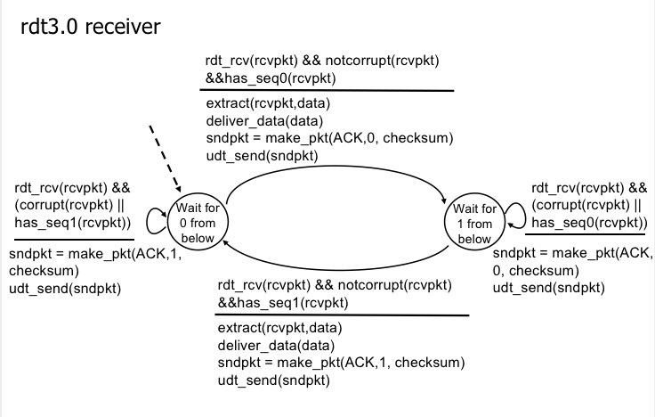

下列函数基于 rdt3.0 的接收端的有限状态机实现了可靠接受消息的功能，并将接收到的文件通过`fstream`存储在磁盘中。在主循环中，代码通过 UDP 套接字 `recvfrom` 函数接收从服务器传来的消息，其中 `recvBuffer` 是接收消息的缓冲区。接收到的消息可能包含不同类型的信息，包括**握手信号（SYN）、文件头（FHD）、挥手信号（FIN、 ACK）以及文件数据**。

- 接收到消息之后，首先要验证消息的[校验和](#校验和)和序列号，当不正确时则重传一个上一状态的信号，即`(state + 1) & 1`。

- 当接收到 SYN 时，客户端向服务器发送 ACK 和 SYN，以建立连接。

- 当接收到 FIN、 ACK 时，客户端向服务器发送 ACK，并进行退出等待。在第一次接收到 FIN 时，创建一个[退出等待](#退出等待客户端)的线程，并**不阻塞主线程**，主线程继续接受服务器可能重传的 FIN、ACK 信号，接收到时则重置等待时间，直到等待时间大于 2 \* RTO， 结束客户端的所有线程。

- 当接收到包含文件头的消息时，从消息中提取文件描述符，包括文件名和文件大小。随后，客户端创建一个新文件并将接收到的文件数据写入文件。

- 当接收到普通数据包时，将数据写入文件，并发送 ACK 给服务器。如果文件接收完成，关闭文件。

该函数通过验证消息的校验和和序列号，确保了消息的可靠性。根据消息类型的不同，执行相应的操作，包括建立连接、接收文件头和文件数据、发送 ACK，并处理退出等待。在接收过程中，通过向服务器发送 ACK，保证了数据传输的可靠性和完整性。

```cpp
void beginRecv() {
    // 接收从服务器传来的消息
    Message recvBuffer;

    // 写入文件
    ofstream ofs;
    unsigned int fileSize;
    unsigned int currentSize = 0;
    string filename;

    while (true) {
        // 从客户端套接字接收消息
        int serverAddressLength = sizeof(SOCKADDR);
        int recvLength =
            recvfrom(clientSocket, (char*)&recvBuffer, sizeof(Message), 0,
                     (sockaddr*)&serverAddr, &serverAddressLength);

        // 检测是否接收成功
        if (recvLength == -1) {
            cerr << "Error receiving data.\n";
            exit(0);
        }

        // 打印接收到的消息内容
        if (PRINT_LOG) {
            printf("[RECV]");
            recvBuffer.printMessage();
        }

        // 验证消息的校验和，且序列号与期望序列号相等
        if (recvBuffer.checksumValid(&recvPseudoHeader) &&
            recvBuffer.seq == state) {
            // 如果消息是SYN
            if (recvBuffer.getFlag(SYN)) {
                // 向服务器发送ACK和SYN
                if (sendFlag(state, ACK | SYN)) {
                    printf("[LOG] Shake hand successfully!\n");
                }
            }
            // 如果消息是FIN
            else if (recvBuffer.getFlag(FIN | ACK) == (FIN | ACK)) {
                // 向服务器发送ACK
                sendFlag(state, ACK);
                exitTime = 0;
                // 等待退出
                if (!beginExit) {
                    beginExit = true;
                    HANDLE myWaitThread =
                        CreateThread(NULL, 0, waitExit, NULL, 0, 0);
                    WaitForSingleObject(myWaitThread, INFINITE);
                }
            }
            // 如果消息包含数据
            else {
                // 如果消息包含文件头
                if (recvBuffer.getFlag(FHD)) {
                    // 从消息中提取文件描述符
                    FileDescriptor fileDescriptor;
                    memcpy(&fileDescriptor, recvBuffer.data,
                           sizeof(FileDescriptor));

                    // 打印接收到的文件头信息
                    printf("[LOG] Receive file header: [Name:%s] [Size:%d]\n",
                           fileDescriptor.fileName, fileDescriptor.fileSize);

                    // 设置文件大小和文件名
                    fileSize = fileDescriptor.fileSize;
                    filename = fileDir + "/" + fileDescriptor.fileName;
                    currentSize = 0;

                    // 创建文件
                    ofs.open(filename, ios::out | ios::binary | ios::trunc);
                } else {
                    // 写入文件
                    ofs.write((char*)recvBuffer.data, recvBuffer.getLen());
                    currentSize += recvBuffer.getLen();
                }

                // 向服务器发送ACK
                sendFlag(state, ACK);

                // 如果文件接收完成
                if (currentSize >= fileSize) {
                    printf("[LOG] File receive success! %s\n",
                           filename.c_str());
                    ofs.close();
                }
            }

            // 更新当前的期望序列号
            state = (state + 1) & 1;
        } else {
            // 如果数据包无效或者接收序列号与当前序列号不相等，
            // 需要重新发送上一个ACK
            // 如果消息是SYN，重新发送ACK和SYN，否则，重新发送ACK
            if (recvBuffer.getFlag(SYN)) {
                if (sendFlag((state + 1) & 1, ACK | SYN)) {
                    printf("[LOG] Shake hand successfully!\n");
                }
            } else {
                sendFlag((state + 1) & 1, ACK);
            }
        }
    }
}
```

### 5. 传递数据

#### 文件描述结构体

在建立连接之后，协议规定先发送一个文件描述的结构体，并将消息的**FHD 标志位**置为 1，包含文件名和文件大小信息，以方便后续的实验。文件描述结构体定义如下：

```cpp
// 文件描述符结构体，用于描述文件信息
struct FileDescriptor {
    char fileName[20];  // 文件名
    int fileSize;       // 文件大小
};
```

客户端收到之后，需要返回一个**ACK**信号。

#### 发送消息

该函数用于构造并发送消息，首先根据输入的标志位、数据段大小、数据段指针构造消息，然后调用[sendPackage](#发送端服务器)函数发送消息。

```cpp
// 发送消息的函数，用于构造并发送消息
void sendMessage(uint16_t flags, uint16_t dataSize, char* dataPtr) {
    // 构建消息的发送缓冲区，初始化端口号和状态
    Message sendBuffer{SERVER_PORT, CLIENT_PORT, 0, state};
    sendBuffer.setFlag(flags);
    sendBuffer.setLen(dataSize);
    sendBuffer.setData(dataPtr);
    sendBuffer.setChecksum(&sendPseudoHeader);

    // 调用发送消息的函数
    sendPackage(sendBuffer);
}
```

#### 发送文件

1. 遍历给定的文件名数组 `fileNameArr`。

2. 对每个文件名，打开相应的文件，获取文件大小，并创建一个包含文件名和大小的文件描述符对象 `FileDescriptor`。

3. 通过 `sendMessage` 函数发送包含文件名和大小的文件描述消息，使用 `ACK | FHD` 作为标志。

4. 计算需要多少个报文来传输整个文件，每个报文的大小为 `MSS`（最大报文段长度）。

5. 按段读取文件内容，并通过 `sendMessage` 函数发送每个文件段，使用 `ACK` 作为标志。

6. 打印日志，记录当前文件传输的进度。

7. 计算文件传输的耗时，并打印相关的传输信息，包括文件名、文件大小、传输时长、吞吐率（Throughput Rate）和数据包丢失率（Packet Loss Rate）。

总体而言，该函数用于按段发送给定文件名数组中文件的内容，记录传输过程中的相关信息，并打印传输结果的统计信息。

```cpp
// 发送文件的函数，根据文件名数组和数量发送文件内容
void sendFiles(char* fileNameArr[], int size) {
    // 遍历文件名数组
    for (int i = 0; i < size; i++) {
        // 开始计时
        auto start = chrono::steady_clock::now();

        // 创建文件描述符对象，存储文件名和大小
        FileDescriptor file;
        strcpy(file.fileName, fileNameArr[i]);

        // 打开文件并获取文件大小
        ifstream ifs(fileDir + "/" + file.fileName,
                     ios::binary | ios::ate | ios::app);
        file.fileSize = ifs.tellg();
        ifs.seekg(0, ios::beg);

        // 发送包含文件名和大小的文件描述消息
        sendMessage(ACK | FHD, sizeof(FileDescriptor), (char*)&file);

        // 计算需要多少个报文
        int segments = (file.fileSize + MSS - 1) / MSS;

        // 按段发送文件内容
        int len = file.fileSize;
        for (int i = 0; i < segments; i++) {
            char fileContent[MSS];
            ifs.read(fileContent, min(len, MSS));
            sendMessage(ACK, min(len, MSS), fileContent);
            len -= MSS;

            // 打印日志
            if (PRINT_LOG) {
                printf("[Seg %d in %d]\n", i, segments - 1);
            }
        }

        // 结束及时并计算耗时
        auto end = chrono::steady_clock::now();
        auto duration =
            chrono::duration_cast<chrono::milliseconds>(end - start).count();

        // 打印文件传输的相关信息
        printf(
            "fileName:%s, fileSize:%dbytes, duration:%dms,\n"
            "Throughput Rate:%.5fkbs, Packet Loss Rate:%.5f\n",
            file.fileName, file.fileSize, duration,
            ((float)file.fileSize * 8 / duration), (float)lossNum / sendNum);
        lossNum = 0;
        sendNum = 0;
    }
}
```

## 实验结果

下面我将丢包率设置为 `2%`，超时重传时间设置为 `2ms`，发送`1.jpg`文件，分析输出的日志。

### 1. 两次握手

<center>服务器两次握手日志</center>

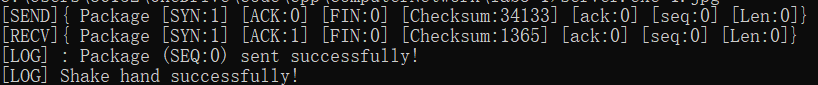

<center>客户端两次握手日志</center>

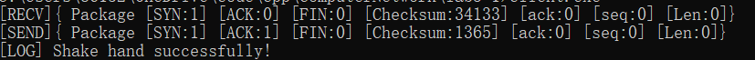

可以看到服务器首先发送了一个 `SYN `消息，并且状态位 seq 为 0，然后客户端接收到该消息，并发送了一个`SYN | ACK`信号，seq 同样为 0，并在**没发生丢包的情况下**输出`Shake hand successfully!`，服务器接收到该消息后，输出包传递成功，并输出成功握手。

### 2. 传送文件描述结构体

<center>服务器传送文件描述结构体日志</center>

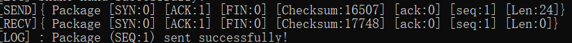

<center>客户端传送文件描述结构体日志</center>

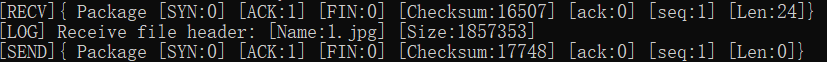

可以看到服务器首先发出一个标志位为`ACK | FHD`的消息，seq 为 1，然后客户端接收到该消息，输出接收到的文件名称为`1.jpg`，文件大小为`1857353`字节，并发送了一个`ACK`消息，seq 为 1，服务器接收到该消息后，输出包传递成功。

### 3. 传递数据

<center>服务器传递数据日志</center>

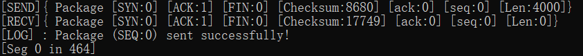

<center>客户端传递数据日志</center>

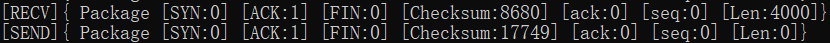

可以看到服务器首先发出一个标志位为`ACK`的消息，seq 为 0，报文段长度为 4000，然后客户端接收到该消息，,并发送了一个`ACK`消息，seq 为 0，服务器接收到该消息后，输出包传递成功，并输出当前进度。

### 4. 超时重传

<center>服务器超时重传日志</center>

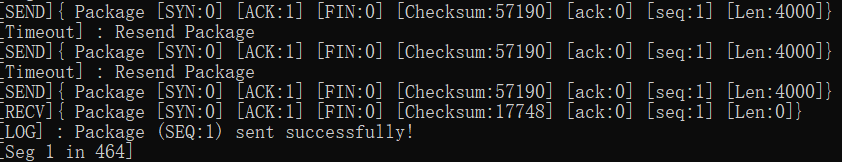

<center>客户端超时重传日志</center>

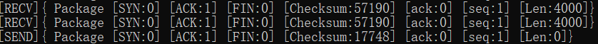

可以看到服务器首先发出一条消息后，出现了 Timeout，然后服务器重传之后再次出现了 Timeout，并再次重传，得到了客户端的 ACK 消息。所以对于`Seg 1`数据段，服务器一共发送了三次，丢了两次包，然而客户端只接收到两次，说明这两次丢包一个是由服务器发送的消息丢失造成的，一个是由客户端发送的消息丢失造成的。

### 5. 文件传输完成

<center>服务器文件传输完成日志</center>

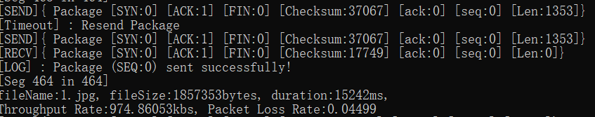

<center>客户端文件传输完成日志</center>

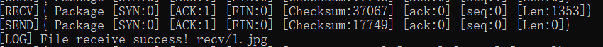

可以看到服务器最后一次传输数据时长度不是`4000`，而是`1353`，这正是`1857353`(文件总大小)相对于`4000`(MSS)的余数。并且发生了一次丢包，然后文件传输完成。服务器输出了传输时间为`15242ms`，吞吐率为`974.861kbps`，丢包率为`4.499%`，之所以不是设定的`2%`是由于服务器发送的消息和客户端发送的消息都可能丢失，造成超时重传，所以服务器输出的丢包率应该为`4%`左右，而由于样本较少，所以丢包率在`4%`附近波动。

### 6.两次挥手

<center>服务器两次挥手日志</center>

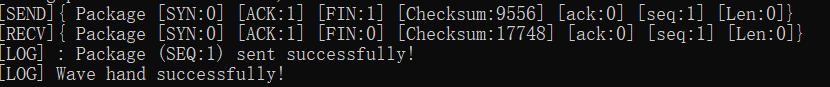

<center>客户端两次挥手日志</center>

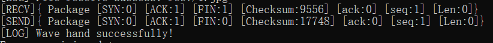

可以看到服务器首先发送了一个 `ACK | FIN `消息，并且状态位 seq 为 1，然后客户端接收到该消息，并发送了一个`ACK`信号，seq 同样为 1，并在**等待了 2 \* RTO 的情况下**输出`Wave hand successfully!`，服务器接收到该消息后，输出包传递成功，并输出成功挥手，然后程序结束。
